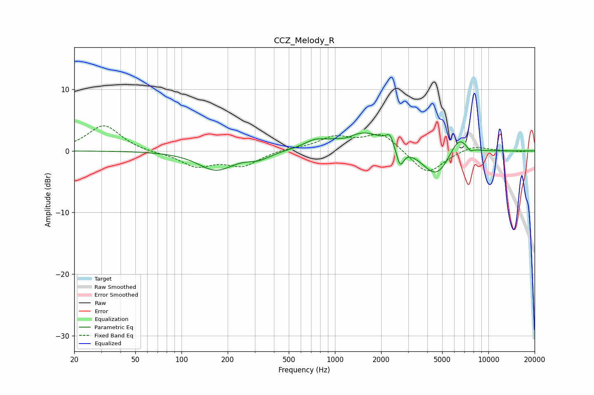

# CCZ_Melody_R
See [usage instructions](https://github.com/jaakkopasanen/AutoEq#usage) for more options and info.

### Parametric EQs
Apply preamp of -3.0 dB when using parametric equalizer.

|   # | Type    |   Fc (Hz) |    Q |   Gain (dB) |
|-----|---------|-----------|------|-------------|
|   1 | Peaking |       167 | 1.24 |        -3.1 |
|   2 | Peaking |       320 | 1.88 |        -1.1 |
|   3 | Peaking |       739 | 2    |         1.1 |
|   4 | Peaking |      1198 | 3.07 |        -0.5 |
|   5 | Peaking |      1539 | 0.89 |         3.2 |
|   6 | Peaking |      2278 | 5.94 |         1.7 |
|   7 | Peaking |      2656 | 5.98 |        -3.1 |
|   8 | Peaking |      4581 | 1.51 |        -4.7 |
|   9 | Peaking |      6399 | 2.21 |         3.3 |
|  10 | Peaking |      7590 | 6    |        -0.8 |

### Fixed Band EQs
When using fixed band (also called graphic) equalizer, apply preamp of **-4.2 dB** (if available) and set gains manually with these parameters.

|   # | Type    |   Fc (Hz) |    Q |   Gain (dB) |
|-----|---------|-----------|------|-------------|
|   1 | Peaking |        31 | 1.41 |         4.2 |
|   2 | Peaking |        62 | 1.41 |        -0.3 |
|   3 | Peaking |       125 | 1.41 |        -2.4 |
|   4 | Peaking |       250 | 1.41 |        -2.3 |
|   5 | Peaking |       500 | 1.41 |         0.4 |
|   6 | Peaking |      1000 | 1.41 |         2.1 |
|   7 | Peaking |      2000 | 1.41 |         2.9 |
|   8 | Peaking |      4000 | 1.41 |        -3.9 |
|   9 | Peaking |      8000 | 1.41 |         1   |
|  10 | Peaking |     16000 | 1.41 |        -0.1 |

### Graphs

