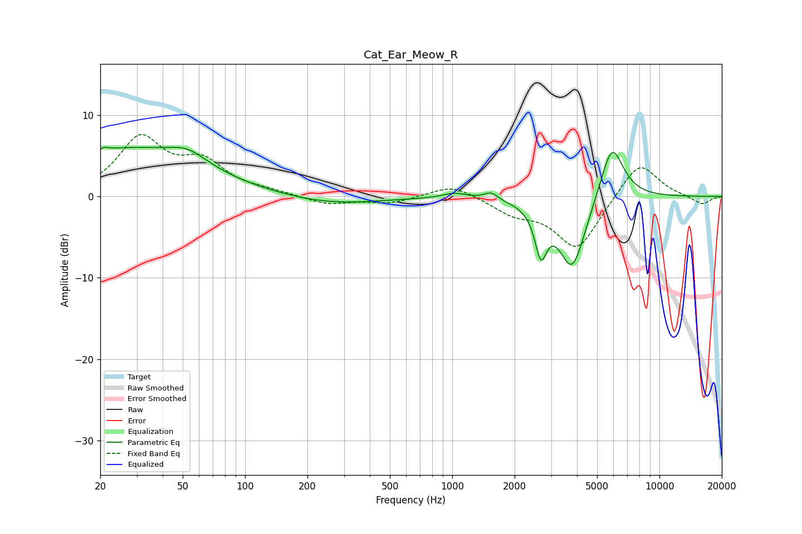

# Cat_Ear_Meow_R
See [usage instructions](https://github.com/jaakkopasanen/AutoEq#usage) for more options and info.

### Parametric EQs
Apply preamp of -6.1 dB when using parametric equalizer.

|   # | Type    |   Fc (Hz) |    Q |   Gain (dB) |
|-----|---------|-----------|------|-------------|
|   1 | Peaking |        20 | 5.97 |        -3   |
|   2 | Peaking |        20 | 5.92 |         3.2 |
|   3 | Peaking |        26 | 0.39 |         5.7 |
|   4 | Peaking |        53 | 1.52 |         1.7 |
|   5 | Peaking |       256 | 0.6  |        -1   |
|   6 | Peaking |      1027 | 2.52 |         0.7 |
|   7 | Peaking |      1537 | 4.24 |         0.9 |
|   8 | Peaking |      2678 | 4.99 |        -5.4 |
|   9 | Peaking |      3792 | 2.09 |        -9.1 |
|  10 | Peaking |      5886 | 2.39 |         7.3 |

### Fixed Band EQs
When using fixed band (also called graphic) equalizer, apply preamp of **-7.7 dB** (if available) and set gains manually with these parameters.

|   # | Type    |   Fc (Hz) |    Q |   Gain (dB) |
|-----|---------|-----------|------|-------------|
|   1 | Peaking |        31 | 1.41 |         6.9 |
|   2 | Peaking |        62 | 1.41 |         3.7 |
|   3 | Peaking |       125 | 1.41 |         0.5 |
|   4 | Peaking |       250 | 1.41 |        -1   |
|   5 | Peaking |       500 | 1.41 |        -0.8 |
|   6 | Peaking |      1000 | 1.41 |         1.6 |
|   7 | Peaking |      2000 | 1.41 |        -1.8 |
|   8 | Peaking |      4000 | 1.41 |        -6.5 |
|   9 | Peaking |      8000 | 1.41 |         4.6 |
|  10 | Peaking |     16000 | 1.41 |        -1   |

### Graphs

