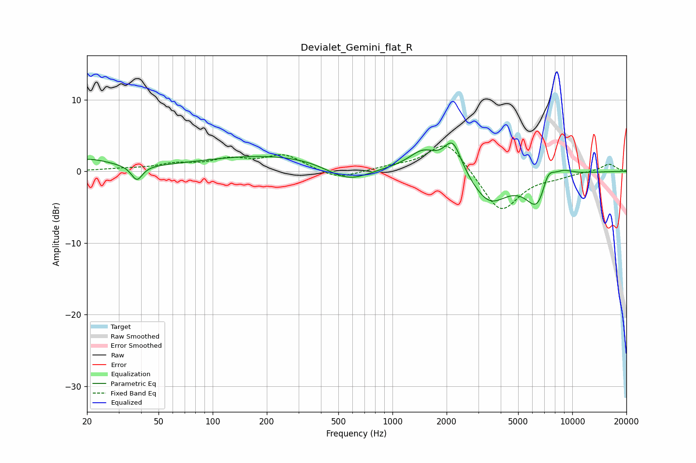

# Devialet_Gemini_flat_R
See [usage instructions](https://github.com/jaakkopasanen/AutoEq#usage) for more options and info.

### Parametric EQs
Apply preamp of -4.1 dB when using parametric equalizer.

|   # | Type    |   Fc (Hz) |    Q |   Gain (dB) |
|-----|---------|-----------|------|-------------|
|   1 | Peaking |        20 | 1.09 |         1.6 |
|   2 | Peaking |        38 | 4.69 |        -2.1 |
|   3 | Peaking |       250 | 0.3  |         2.4 |
|   4 | Peaking |       567 | 1.09 |        -2.8 |
|   5 | Peaking |      1480 | 1.79 |         2.6 |
|   6 | Peaking |      2166 | 2.88 |         4.4 |
|   7 | Peaking |      3457 | 1.4  |        -4.4 |
|   8 | Peaking |      6520 | 2.07 |        -5.7 |
|   9 | Peaking |      7275 | 3.4  |         3.5 |
|  10 | Peaking |      8782 | 2.15 |         1.1 |

### Fixed Band EQs
When using fixed band (also called graphic) equalizer, apply preamp of **-3.6 dB** (if available) and set gains manually with these parameters.

|   # | Type    |   Fc (Hz) |    Q |   Gain (dB) |
|-----|---------|-----------|------|-------------|
|   1 | Peaking |        31 | 1.41 |         0.3 |
|   2 | Peaking |        62 | 1.41 |         0.9 |
|   3 | Peaking |       125 | 1.41 |         1.4 |
|   4 | Peaking |       250 | 1.41 |         2.2 |
|   5 | Peaking |       500 | 1.41 |        -1.2 |
|   6 | Peaking |      1000 | 1.41 |         0.5 |
|   7 | Peaking |      2000 | 1.41 |         4.5 |
|   8 | Peaking |      4000 | 1.41 |        -5.9 |
|   9 | Peaking |      8000 | 1.41 |        -0.6 |
|  10 | Peaking |     16000 | 1.41 |         1.1 |

### Graphs

