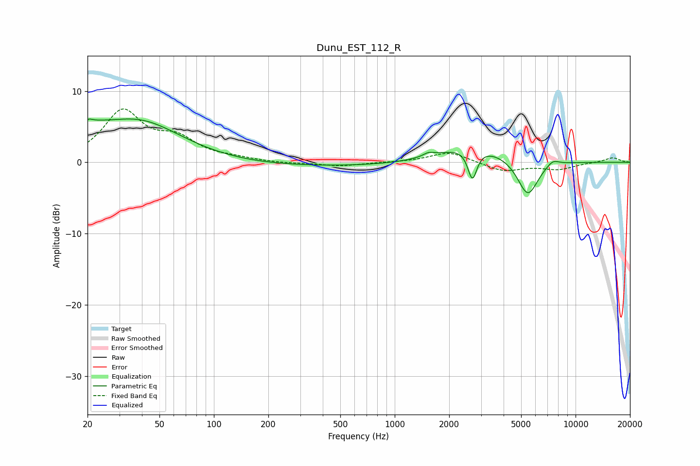

# Dunu_EST_112_R
See [usage instructions](https://github.com/jaakkopasanen/AutoEq#usage) for more options and info.

### Parametric EQs
Apply preamp of -6.2 dB when using parametric equalizer.

|   # | Type    |   Fc (Hz) |    Q |   Gain (dB) |
|-----|---------|-----------|------|-------------|
|   1 | Peaking |        20 | 5.8  |         3.3 |
|   2 | Peaking |        20 | 5.99 |        -2.3 |
|   3 | Peaking |        21 | 1.37 |         1.8 |
|   4 | Peaking |        38 | 0.59 |         5.6 |
|   5 | Peaking |       442 | 0.19 |        -0.6 |
|   6 | Peaking |      1541 | 4.71 |         0.5 |
|   7 | Peaking |      2654 | 0.75 |         2.6 |
|   8 | Peaking |      2689 | 5.62 |        -4.3 |
|   9 | Peaking |      5441 | 2.43 |        -5.2 |
|  10 | Peaking |      7482 | 3.89 |         0.8 |

### Fixed Band EQs
When using fixed band (also called graphic) equalizer, apply preamp of **-7.6 dB** (if available) and set gains manually with these parameters.

|   # | Type    |   Fc (Hz) |    Q |   Gain (dB) |
|-----|---------|-----------|------|-------------|
|   1 | Peaking |        31 | 1.41 |         7   |
|   2 | Peaking |        62 | 1.41 |         2.8 |
|   3 | Peaking |       125 | 1.41 |         0.4 |
|   4 | Peaking |       250 | 1.41 |        -0.2 |
|   5 | Peaking |       500 | 1.41 |        -0.5 |
|   6 | Peaking |      1000 | 1.41 |        -0   |
|   7 | Peaking |      2000 | 1.41 |         1.5 |
|   8 | Peaking |      4000 | 1.41 |        -1.3 |
|   9 | Peaking |      8000 | 1.41 |        -0.9 |
|  10 | Peaking |     16000 | 1.41 |         0.7 |

### Graphs

