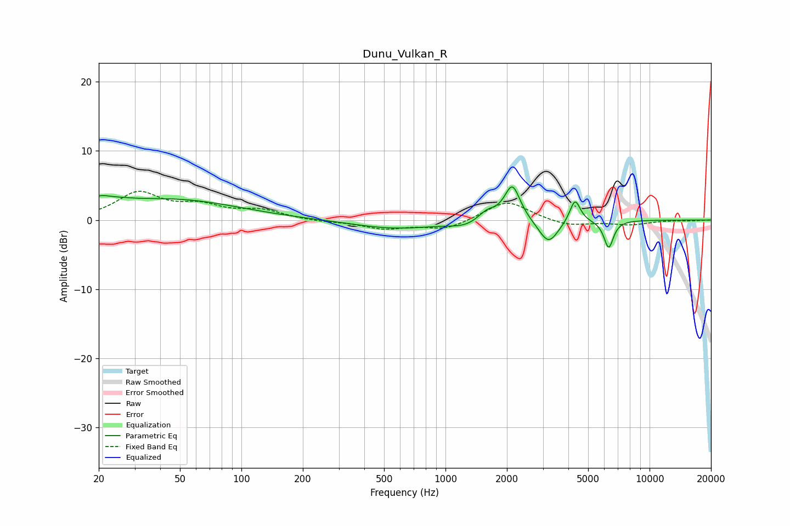

# Dunu_Vulkan_R
See [usage instructions](https://github.com/jaakkopasanen/AutoEq#usage) for more options and info.

### Parametric EQs
Apply preamp of -4.9 dB when using parametric equalizer.

|   # | Type    |   Fc (Hz) |    Q |   Gain (dB) |
|-----|---------|-----------|------|-------------|
|   1 | Peaking |        20 | 3.1  |         1.1 |
|   2 | Peaking |        24 | 1.42 |         0.9 |
|   3 | Peaking |        47 | 0.45 |         2.9 |
|   4 | Peaking |       564 | 0.69 |        -1.2 |
|   5 | Peaking |      1258 | 1.84 |        -0.8 |
|   6 | Peaking |      1596 | 3.09 |         1.4 |
|   7 | Peaking |      2126 | 3.64 |         5.2 |
|   8 | Peaking |      3200 | 2.95 |        -3.5 |
|   9 | Peaking |      4313 | 5.47 |         3.4 |
|  10 | Peaking |      6305 | 6    |        -4   |

### Fixed Band EQs
When using fixed band (also called graphic) equalizer, apply preamp of **-4.3 dB** (if available) and set gains manually with these parameters.

|   # | Type    |   Fc (Hz) |    Q |   Gain (dB) |
|-----|---------|-----------|------|-------------|
|   1 | Peaking |        31 | 1.41 |         3.8 |
|   2 | Peaking |        62 | 1.41 |         1.8 |
|   3 | Peaking |       125 | 1.41 |         1.3 |
|   4 | Peaking |       250 | 1.41 |        -0.2 |
|   5 | Peaking |       500 | 1.41 |        -1.2 |
|   6 | Peaking |      1000 | 1.41 |        -1.4 |
|   7 | Peaking |      2000 | 1.41 |         2.9 |
|   8 | Peaking |      4000 | 1.41 |        -0.9 |
|   9 | Peaking |      8000 | 1.41 |        -0.6 |
|  10 | Peaking |     16000 | 1.41 |        -0.1 |

### Graphs

