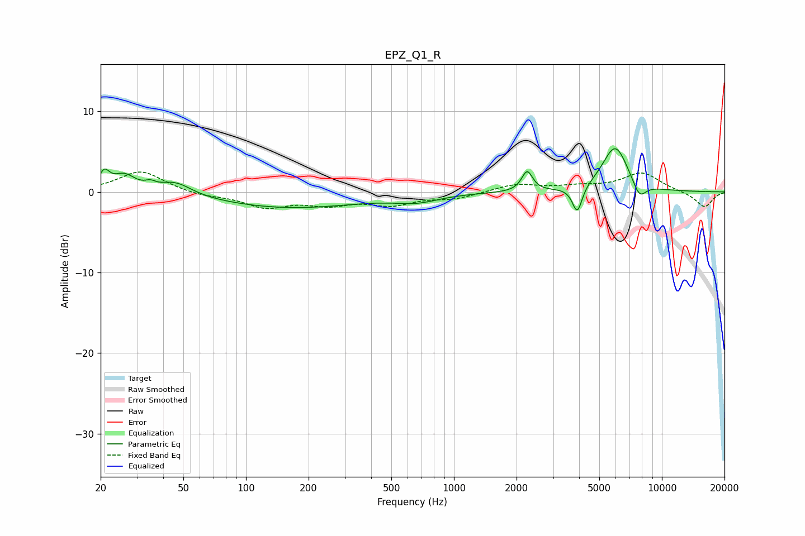

# EPZ_Q1_R
See [usage instructions](https://github.com/jaakkopasanen/AutoEq#usage) for more options and info.

### Parametric EQs
Apply preamp of -5.4 dB when using parametric equalizer.

|   # | Type    |   Fc (Hz) |    Q |   Gain (dB) |
|-----|---------|-----------|------|-------------|
|   1 | Peaking |        21 | 5.93 |         2   |
|   2 | Peaking |        26 | 2.55 |         2   |
|   3 | Peaking |        35 | 5.9  |         0.5 |
|   4 | Peaking |        46 | 1.81 |         1.6 |
|   5 | Peaking |       161 | 0.4  |        -2   |
|   6 | Peaking |       663 | 1.36 |        -0.9 |
|   7 | Peaking |      2249 | 5.5  |         2.5 |
|   8 | Peaking |      3919 | 6    |        -3.3 |
|   9 | Peaking |      5966 | 2.2  |         5.7 |
|  10 | Peaking |      7793 | 4.06 |        -2.1 |

### Fixed Band EQs
When using fixed band (also called graphic) equalizer, apply preamp of **-2.6 dB** (if available) and set gains manually with these parameters.

|   # | Type    |   Fc (Hz) |    Q |   Gain (dB) |
|-----|---------|-----------|------|-------------|
|   1 | Peaking |        31 | 1.41 |         2.6 |
|   2 | Peaking |        62 | 1.41 |        -0.5 |
|   3 | Peaking |       125 | 1.41 |        -1.8 |
|   4 | Peaking |       250 | 1.41 |        -1.3 |
|   5 | Peaking |       500 | 1.41 |        -1.4 |
|   6 | Peaking |      1000 | 1.41 |        -0.8 |
|   7 | Peaking |      2000 | 1.41 |         0.9 |
|   8 | Peaking |      4000 | 1.41 |         0.6 |
|   9 | Peaking |      8000 | 1.41 |         2.3 |
|  10 | Peaking |     16000 | 1.41 |        -1.9 |

### Graphs

