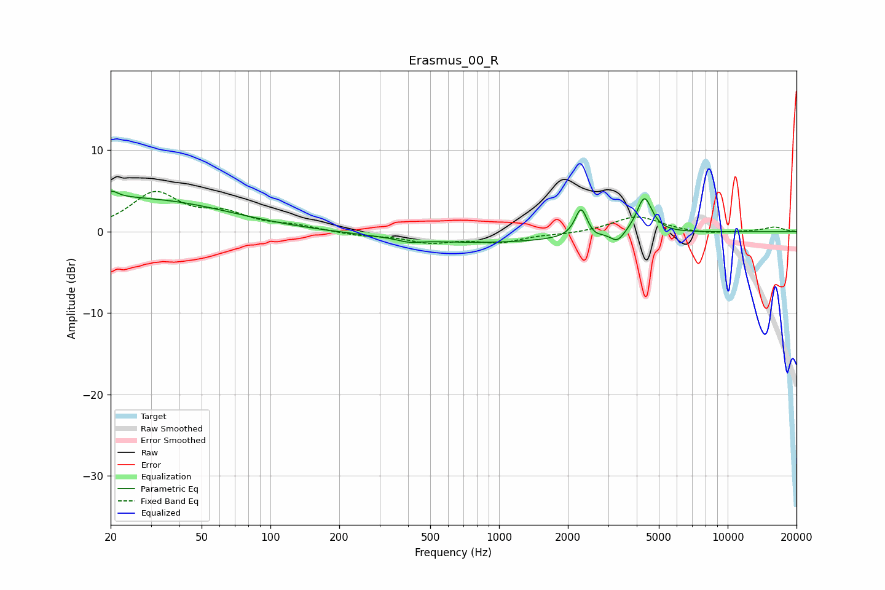

# Erasmus_00_R
See [usage instructions](https://github.com/jaakkopasanen/AutoEq#usage) for more options and info.

### Parametric EQs
Apply preamp of -5.1 dB when using parametric equalizer.

|   # | Type    |   Fc (Hz) |    Q |   Gain (dB) |
|-----|---------|-----------|------|-------------|
|   1 | Peaking |        20 | 5.68 |         3.1 |
|   2 | Peaking |        20 | 6    |        -2   |
|   3 | Peaking |        21 | 1.26 |         1   |
|   4 | Peaking |        33 | 0.44 |         3.5 |
|   5 | Peaking |       404 | 2.94 |        -0.4 |
|   6 | Peaking |       828 | 0.37 |        -1.3 |
|   7 | Peaking |      2284 | 5.5  |         3.5 |
|   8 | Peaking |      2626 | 6    |        -0.4 |
|   9 | Peaking |      3293 | 4.68 |        -1.3 |
|  10 | Peaking |      4321 | 4.26 |         4.5 |

### Fixed Band EQs
When using fixed band (also called graphic) equalizer, apply preamp of **-5.0 dB** (if available) and set gains manually with these parameters.

|   # | Type    |   Fc (Hz) |    Q |   Gain (dB) |
|-----|---------|-----------|------|-------------|
|   1 | Peaking |        31 | 1.41 |         4.6 |
|   2 | Peaking |        62 | 1.41 |         1.8 |
|   3 | Peaking |       125 | 1.41 |         0.6 |
|   4 | Peaking |       250 | 1.41 |        -0.4 |
|   5 | Peaking |       500 | 1.41 |        -1.2 |
|   6 | Peaking |      1000 | 1.41 |        -1.2 |
|   7 | Peaking |      2000 | 1.41 |        -0.2 |
|   8 | Peaking |      4000 | 1.41 |         1.9 |
|   9 | Peaking |      8000 | 1.41 |        -0.3 |
|  10 | Peaking |     16000 | 1.41 |         0.6 |

### Graphs

