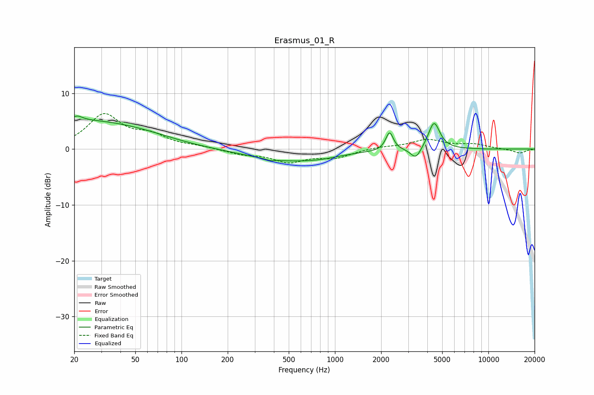

# Erasmus_01_R
See [usage instructions](https://github.com/jaakkopasanen/AutoEq#usage) for more options and info.

### Parametric EQs
Apply preamp of -6.0 dB when using parametric equalizer.

|   # | Type    |   Fc (Hz) |    Q |   Gain (dB) |
|-----|---------|-----------|------|-------------|
|   1 | Peaking |        20 | 0.4  |         4.5 |
|   2 | Peaking |        21 | 3.94 |         0.9 |
|   3 | Peaking |        53 | 0.57 |         1.4 |
|   4 | Peaking |       380 | 5.99 |        -0.3 |
|   5 | Peaking |       493 | 0.53 |        -2.1 |
|   6 | Peaking |       808 | 1.3  |        -0.3 |
|   7 | Peaking |      2270 | 5.88 |         3.3 |
|   8 | Peaking |      3366 | 4.18 |        -2.1 |
|   9 | Peaking |      4423 | 3.81 |         4.9 |
|  10 | Peaking |      9780 | 6    |        -0   |

### Fixed Band EQs
When using fixed band (also called graphic) equalizer, apply preamp of **-6.5 dB** (if available) and set gains manually with these parameters.

|   # | Type    |   Fc (Hz) |    Q |   Gain (dB) |
|-----|---------|-----------|------|-------------|
|   1 | Peaking |        31 | 1.41 |         6   |
|   2 | Peaking |        62 | 1.41 |         2.1 |
|   3 | Peaking |       125 | 1.41 |         0.4 |
|   4 | Peaking |       250 | 1.41 |        -0.8 |
|   5 | Peaking |       500 | 1.41 |        -2.1 |
|   6 | Peaking |      1000 | 1.41 |        -1.4 |
|   7 | Peaking |      2000 | 1.41 |         0.4 |
|   8 | Peaking |      4000 | 1.41 |         1.6 |
|   9 | Peaking |      8000 | 1.41 |         0.8 |
|  10 | Peaking |     16000 | 1.41 |        -0.7 |

### Graphs

