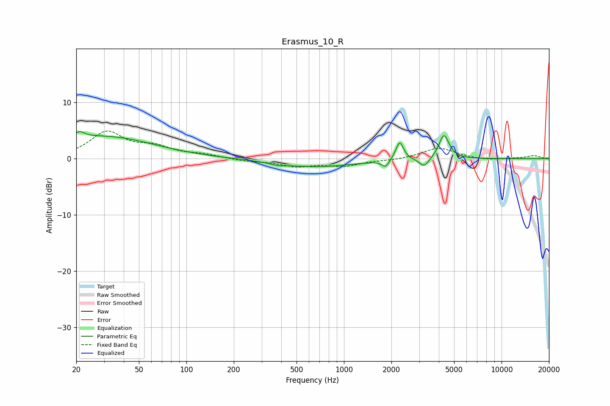

# Erasmus_10_R
See [usage instructions](https://github.com/jaakkopasanen/AutoEq#usage) for more options and info.

### Parametric EQs
Apply preamp of -4.9 dB when using parametric equalizer.

|   # | Type    |   Fc (Hz) |    Q |   Gain (dB) |
|-----|---------|-----------|------|-------------|
|   1 | Peaking |        20 | 0.3  |         3.6 |
|   2 | Peaking |        21 | 6    |        -2.2 |
|   3 | Peaking |        21 | 5.84 |         3.1 |
|   4 | Peaking |        39 | 0.7  |         0.7 |
|   5 | Peaking |       385 | 3.04 |        -0.4 |
|   6 | Peaking |       668 | 0.55 |        -1.4 |
|   7 | Peaking |      1834 | 6    |        -1.3 |
|   8 | Peaking |      2256 | 5.8  |         3.3 |
|   9 | Peaking |      3234 | 4.5  |        -1.6 |
|  10 | Peaking |      4311 | 4.43 |         4.3 |

### Fixed Band EQs
When using fixed band (also called graphic) equalizer, apply preamp of **-5.0 dB** (if available) and set gains manually with these parameters.

|   # | Type    |   Fc (Hz) |    Q |   Gain (dB) |
|-----|---------|-----------|------|-------------|
|   1 | Peaking |        31 | 1.41 |         4.6 |
|   2 | Peaking |        62 | 1.41 |         1.8 |
|   3 | Peaking |       125 | 1.41 |         0.6 |
|   4 | Peaking |       250 | 1.41 |        -0.4 |
|   5 | Peaking |       500 | 1.41 |        -1.2 |
|   6 | Peaking |      1000 | 1.41 |        -1.2 |
|   7 | Peaking |      2000 | 1.41 |        -0.2 |
|   8 | Peaking |      4000 | 1.41 |         2   |
|   9 | Peaking |      8000 | 1.41 |        -0.3 |
|  10 | Peaking |     16000 | 1.41 |         0.6 |

### Graphs

