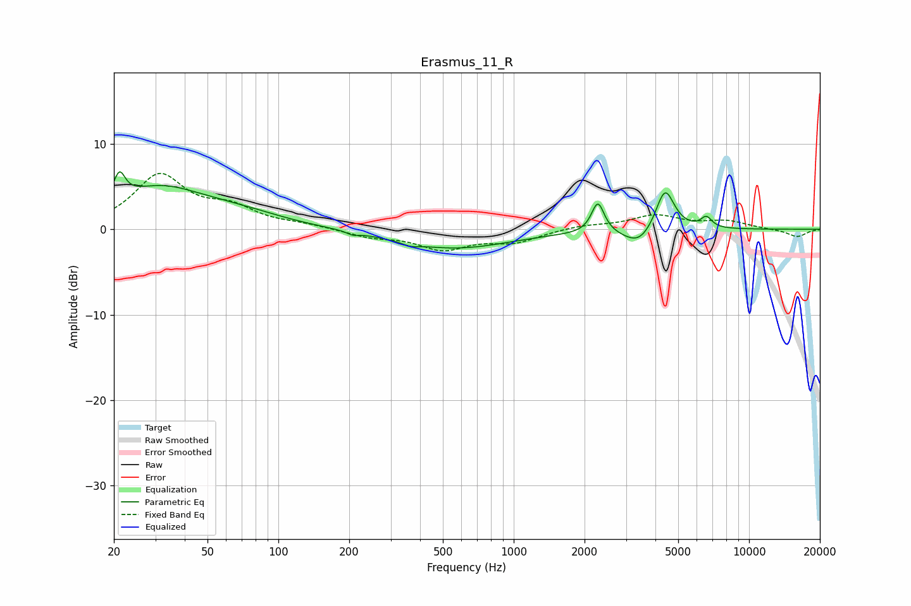

# Erasmus_11_R
See [usage instructions](https://github.com/jaakkopasanen/AutoEq#usage) for more options and info.

### Parametric EQs
Apply preamp of -6.8 dB when using parametric equalizer.

|   # | Type    |   Fc (Hz) |    Q |   Gain (dB) |
|-----|---------|-----------|------|-------------|
|   1 | Peaking |        21 | 5.78 |         3.1 |
|   2 | Peaking |        31 | 0.74 |         4.5 |
|   3 | Peaking |        68 | 0.72 |         1.4 |
|   4 | Peaking |       207 | 5.96 |        -0.4 |
|   5 | Peaking |       364 | 4.13 |        -0.4 |
|   6 | Peaking |       555 | 0.58 |        -2.2 |
|   7 | Peaking |      2279 | 5.33 |         3.6 |
|   8 | Peaking |      3412 | 2.16 |        -2   |
|   9 | Peaking |      4391 | 3.52 |         5.1 |
|  10 | Peaking |      6585 | 5.85 |         1.3 |

### Fixed Band EQs
When using fixed band (also called graphic) equalizer, apply preamp of **-6.6 dB** (if available) and set gains manually with these parameters.

|   # | Type    |   Fc (Hz) |    Q |   Gain (dB) |
|-----|---------|-----------|------|-------------|
|   1 | Peaking |        31 | 1.41 |         6.1 |
|   2 | Peaking |        62 | 1.41 |         2.1 |
|   3 | Peaking |       125 | 1.41 |         0.4 |
|   4 | Peaking |       250 | 1.41 |        -0.8 |
|   5 | Peaking |       500 | 1.41 |        -2.2 |
|   6 | Peaking |      1000 | 1.41 |        -1.4 |
|   7 | Peaking |      2000 | 1.41 |         0.4 |
|   8 | Peaking |      4000 | 1.41 |         1.6 |
|   9 | Peaking |      8000 | 1.41 |         0.9 |
|  10 | Peaking |     16000 | 1.41 |        -0.9 |

### Graphs

