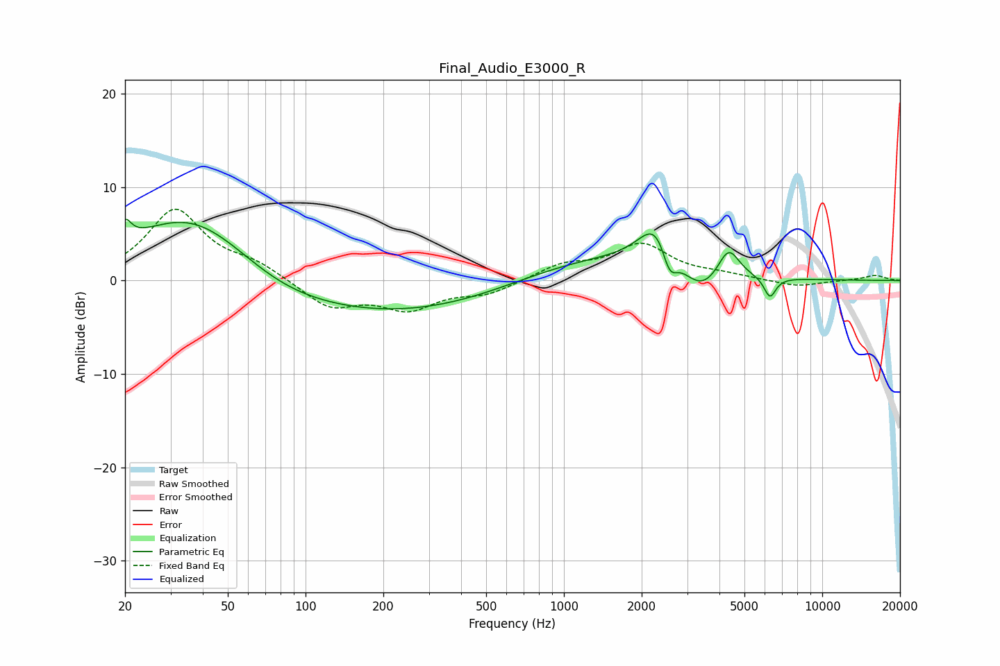

# Final_Audio_E3000_R
See [usage instructions](https://github.com/jaakkopasanen/AutoEq#usage) for more options and info.

### Parametric EQs
Apply preamp of -6.6 dB when using parametric equalizer.

|   # | Type    |   Fc (Hz) |    Q |   Gain (dB) |
|-----|---------|-----------|------|-------------|
|   1 | Peaking |        20 | 5.97 |         2.1 |
|   2 | Peaking |        37 | 0.56 |         7.7 |
|   3 | Peaking |        76 | 0.72 |        -1.5 |
|   4 | Peaking |       213 | 0.3  |        -3.8 |
|   5 | Peaking |      1233 | 0.44 |         2.7 |
|   6 | Peaking |      2311 | 2.01 |         5.3 |
|   7 | Peaking |      2560 | 4.65 |        -3.5 |
|   8 | Peaking |      3379 | 1.72 |        -3.1 |
|   9 | Peaking |      4338 | 3.29 |         3.5 |
|  10 | Peaking |      6275 | 6    |        -2.2 |

### Fixed Band EQs
When using fixed band (also called graphic) equalizer, apply preamp of **-7.7 dB** (if available) and set gains manually with these parameters.

|   # | Type    |   Fc (Hz) |    Q |   Gain (dB) |
|-----|---------|-----------|------|-------------|
|   1 | Peaking |        31 | 1.41 |         7.5 |
|   2 | Peaking |        62 | 1.41 |         1.5 |
|   3 | Peaking |       125 | 1.41 |        -2.9 |
|   4 | Peaking |       250 | 1.41 |        -2.8 |
|   5 | Peaking |       500 | 1.41 |        -1.3 |
|   6 | Peaking |      1000 | 1.41 |         1.6 |
|   7 | Peaking |      2000 | 1.41 |         3.7 |
|   8 | Peaking |      4000 | 1.41 |         0.5 |
|   9 | Peaking |      8000 | 1.41 |        -0.7 |
|  10 | Peaking |     16000 | 1.41 |         0.6 |

### Graphs

