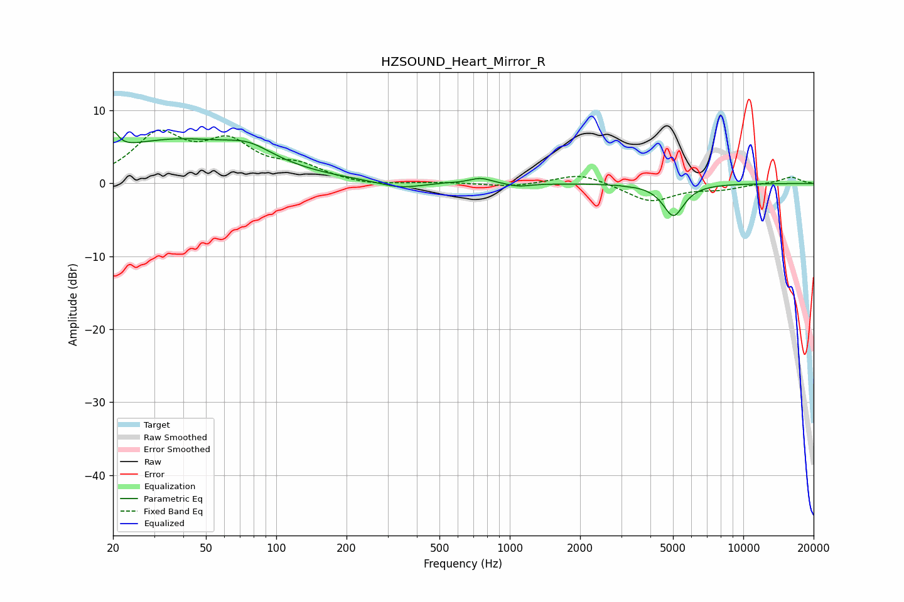

# HZSOUND_Heart_Mirror_R
See [usage instructions](https://github.com/jaakkopasanen/AutoEq#usage) for more options and info.

### Parametric EQs
Apply preamp of -7.1 dB when using parametric equalizer.

|   # | Type    |   Fc (Hz) |    Q |   Gain (dB) |
|-----|---------|-----------|------|-------------|
|   1 | Peaking |        20 | 5.99 |         2.6 |
|   2 | Peaking |        36 | 0.43 |         5.8 |
|   3 | Peaking |        76 | 1.43 |         1.8 |
|   4 | Peaking |       338 | 1.56 |        -0.9 |
|   5 | Peaking |       535 | 5.97 |         0.1 |
|   6 | Peaking |       748 | 2.98 |         0.8 |
|   7 | Peaking |      1089 | 2.82 |        -0.4 |
|   8 | Peaking |      3094 | 5.84 |         1.6 |
|   9 | Peaking |      3096 | 5.93 |        -1.7 |
|  10 | Peaking |      5024 | 3.1  |        -4.4 |

### Fixed Band EQs
When using fixed band (also called graphic) equalizer, apply preamp of **-7.4 dB** (if available) and set gains manually with these parameters.

|   # | Type    |   Fc (Hz) |    Q |   Gain (dB) |
|-----|---------|-----------|------|-------------|
|   1 | Peaking |        31 | 1.41 |         6.3 |
|   2 | Peaking |        62 | 1.41 |         4.9 |
|   3 | Peaking |       125 | 1.41 |         2   |
|   4 | Peaking |       250 | 1.41 |        -0.4 |
|   5 | Peaking |       500 | 1.41 |         0.1 |
|   6 | Peaking |      1000 | 1.41 |        -0.5 |
|   7 | Peaking |      2000 | 1.41 |         1.5 |
|   8 | Peaking |      4000 | 1.41 |        -2.5 |
|   9 | Peaking |      8000 | 1.41 |        -0.7 |
|  10 | Peaking |     16000 | 1.41 |         0.9 |

### Graphs

