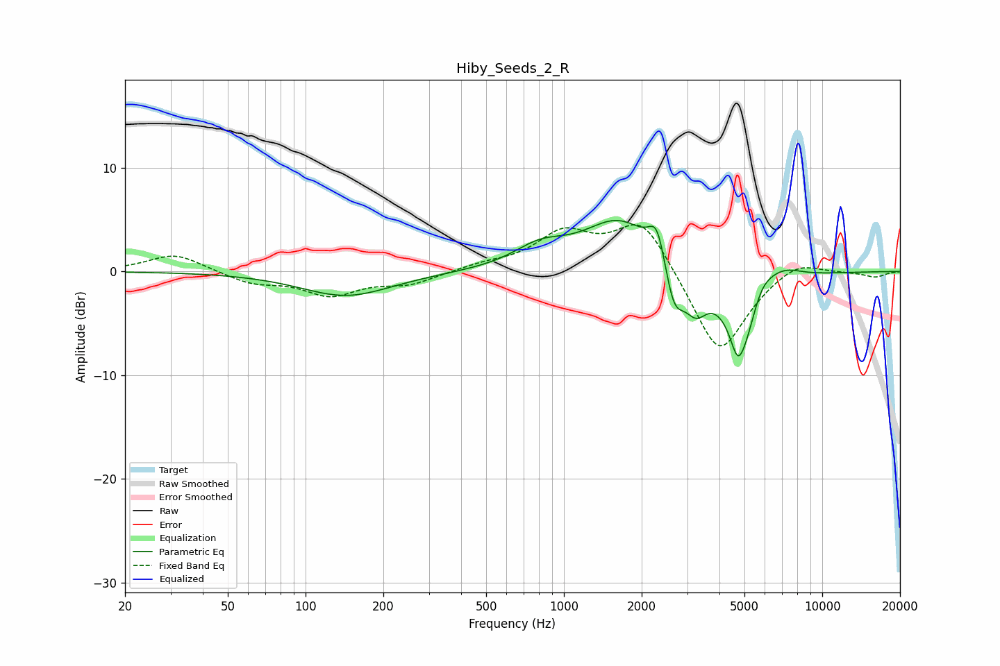

# Hiby_Seeds_2_R
See [usage instructions](https://github.com/jaakkopasanen/AutoEq#usage) for more options and info.

### Parametric EQs
Apply preamp of -5.0 dB when using parametric equalizer.

|   # | Type    |   Fc (Hz) |    Q |   Gain (dB) |
|-----|---------|-----------|------|-------------|
|   1 | Peaking |       144 | 0.8  |        -2.4 |
|   2 | Peaking |       808 | 1.38 |         1.9 |
|   3 | Peaking |      1644 | 1.02 |         5   |
|   4 | Peaking |      2298 | 4.38 |         3.6 |
|   5 | Peaking |      2664 | 3.6  |        -4.5 |
|   6 | Peaking |      3239 | 3.2  |        -3.1 |
|   7 | Peaking |      4707 | 5.28 |        -2.8 |
|   8 | Peaking |      5129 | 1.8  |        -9.7 |
|   9 | Peaking |      5644 | 2.28 |         5   |
|  10 | Peaking |      7011 | 1.78 |         1.5 |

### Fixed Band EQs
When using fixed band (also called graphic) equalizer, apply preamp of **-4.6 dB** (if available) and set gains manually with these parameters.

|   # | Type    |   Fc (Hz) |    Q |   Gain (dB) |
|-----|---------|-----------|------|-------------|
|   1 | Peaking |        31 | 1.41 |         1.7 |
|   2 | Peaking |        62 | 1.41 |        -1.1 |
|   3 | Peaking |       125 | 1.41 |        -2.1 |
|   4 | Peaking |       250 | 1.41 |        -1.1 |
|   5 | Peaking |       500 | 1.41 |         0.6 |
|   6 | Peaking |      1000 | 1.41 |         3.5 |
|   7 | Peaking |      2000 | 1.41 |         5.2 |
|   8 | Peaking |      4000 | 1.41 |        -8.4 |
|   9 | Peaking |      8000 | 1.41 |         1.4 |
|  10 | Peaking |     16000 | 1.41 |        -0.5 |

### Graphs

