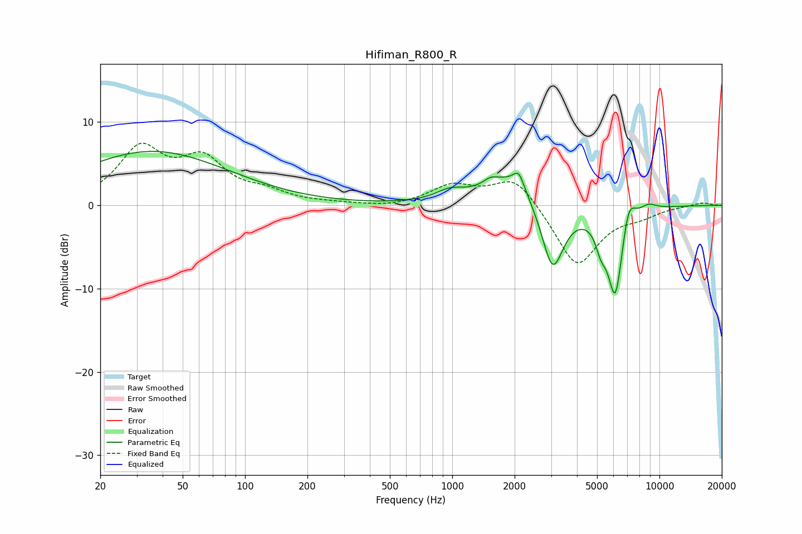

# Hifiman_R800_R
See [usage instructions](https://github.com/jaakkopasanen/AutoEq#usage) for more options and info.

### Parametric EQs
Apply preamp of -6.6 dB when using parametric equalizer.

|   # | Type    |   Fc (Hz) |    Q |   Gain (dB) |
|-----|---------|-----------|------|-------------|
|   1 | Peaking |        36 | 0.38 |         6.5 |
|   2 | Peaking |       972 | 2.14 |         1.1 |
|   3 | Peaking |      1527 | 4.55 |         0.6 |
|   4 | Peaking |      1925 | 1.08 |         3.8 |
|   5 | Peaking |      2095 | 5.56 |         1.9 |
|   6 | Peaking |      3049 | 2.55 |        -8.6 |
|   7 | Peaking |      5215 | 5.71 |        -2.2 |
|   8 | Peaking |      6126 | 3.45 |       -11.2 |
|   9 | Peaking |      7087 | 4.2  |         3.7 |
|  10 | Peaking |      8828 | 3.22 |         0.8 |

### Fixed Band EQs
When using fixed band (also called graphic) equalizer, apply preamp of **-7.6 dB** (if available) and set gains manually with these parameters.

|   # | Type    |   Fc (Hz) |    Q |   Gain (dB) |
|-----|---------|-----------|------|-------------|
|   1 | Peaking |        31 | 1.41 |         6.5 |
|   2 | Peaking |        62 | 1.41 |         4.9 |
|   3 | Peaking |       125 | 1.41 |         1.2 |
|   4 | Peaking |       250 | 1.41 |         0.1 |
|   5 | Peaking |       500 | 1.41 |        -0.3 |
|   6 | Peaking |      1000 | 1.41 |         2.3 |
|   7 | Peaking |      2000 | 1.41 |         3.6 |
|   8 | Peaking |      4000 | 1.41 |        -7.4 |
|   9 | Peaking |      8000 | 1.41 |        -0.9 |
|  10 | Peaking |     16000 | 1.41 |         0.4 |

### Graphs

