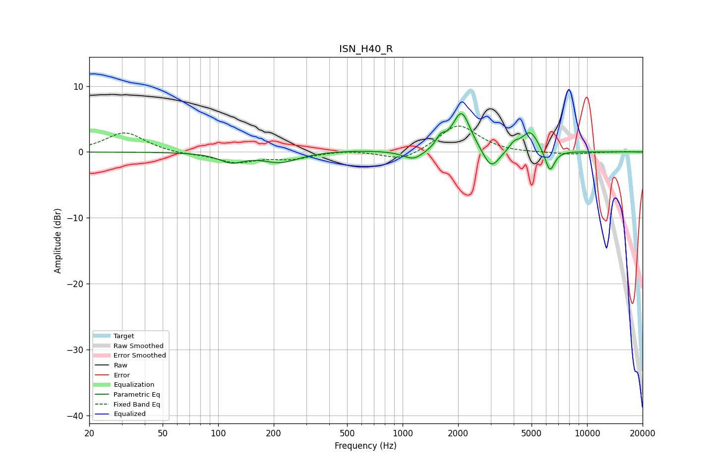

# ISN_H40_R
See [usage instructions](https://github.com/jaakkopasanen/AutoEq#usage) for more options and info.

### Parametric EQs
Apply preamp of -5.9 dB when using parametric equalizer.

|   # | Type    |   Fc (Hz) |    Q |   Gain (dB) |
|-----|---------|-----------|------|-------------|
|   1 | Peaking |       118 | 2.15 |        -1.4 |
|   2 | Peaking |       218 | 1.46 |        -1.5 |
|   3 | Peaking |       542 | 0.66 |         0.3 |
|   4 | Peaking |      1145 | 2.54 |        -1.5 |
|   5 | Peaking |      1607 | 5.75 |         1.4 |
|   6 | Peaking |      2086 | 2.9  |         6.2 |
|   7 | Peaking |      3023 | 3.16 |        -3.2 |
|   8 | Peaking |      4024 | 5.45 |         1   |
|   9 | Peaking |      4912 | 3.11 |         3.2 |
|  10 | Peaking |      6283 | 5.2  |        -3.4 |

### Fixed Band EQs
When using fixed band (also called graphic) equalizer, apply preamp of **-4.0 dB** (if available) and set gains manually with these parameters.

|   # | Type    |   Fc (Hz) |    Q |   Gain (dB) |
|-----|---------|-----------|------|-------------|
|   1 | Peaking |        31 | 1.41 |         3   |
|   2 | Peaking |        62 | 1.41 |        -0.3 |
|   3 | Peaking |       125 | 1.41 |        -1.5 |
|   4 | Peaking |       250 | 1.41 |        -0.9 |
|   5 | Peaking |       500 | 1.41 |         0.3 |
|   6 | Peaking |      1000 | 1.41 |        -1.5 |
|   7 | Peaking |      2000 | 1.41 |         4.2 |
|   8 | Peaking |      4000 | 1.41 |        -0.2 |
|   9 | Peaking |      8000 | 1.41 |        -0.4 |
|  10 | Peaking |     16000 | 1.41 |         0.1 |

### Graphs

