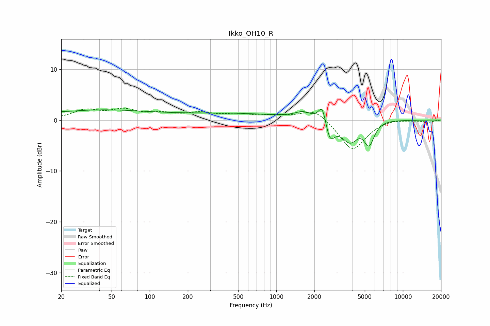

# Ikko_OH10_R
See [usage instructions](https://github.com/jaakkopasanen/AutoEq#usage) for more options and info.

### Parametric EQs
Apply preamp of -2.2 dB when using parametric equalizer.

|   # | Type    |   Fc (Hz) |    Q |   Gain (dB) |
|-----|---------|-----------|------|-------------|
|   1 | Peaking |        20 | 5.61 |         0.1 |
|   2 | Peaking |        31 | 0.39 |         1.5 |
|   3 | Peaking |       129 | 0.4  |        -0.3 |
|   4 | Peaking |       236 | 0.19 |         1.5 |
|   5 | Peaking |      1631 | 2.2  |         1.3 |
|   6 | Peaking |      2311 | 4.71 |         3.7 |
|   7 | Peaking |      2652 | 3.95 |        -3.9 |
|   8 | Peaking |      3866 | 1.91 |        -5.1 |
|   9 | Peaking |      5007 | 1.51 |         2.9 |
|  10 | Peaking |      5383 | 2.95 |        -6.2 |

### Fixed Band EQs
When using fixed band (also called graphic) equalizer, apply preamp of **-2.4 dB** (if available) and set gains manually with these parameters.

|   # | Type    |   Fc (Hz) |    Q |   Gain (dB) |
|-----|---------|-----------|------|-------------|
|   1 | Peaking |        31 | 1.41 |         1.8 |
|   2 | Peaking |        62 | 1.41 |         1.8 |
|   3 | Peaking |       125 | 1.41 |         1   |
|   4 | Peaking |       250 | 1.41 |         1.2 |
|   5 | Peaking |       500 | 1.41 |         1   |
|   6 | Peaking |      1000 | 1.41 |         0.7 |
|   7 | Peaking |      2000 | 1.41 |         2.3 |
|   8 | Peaking |      4000 | 1.41 |        -6.1 |
|   9 | Peaking |      8000 | 1.41 |         0.4 |
|  10 | Peaking |     16000 | 1.41 |        -0.4 |

### Graphs

