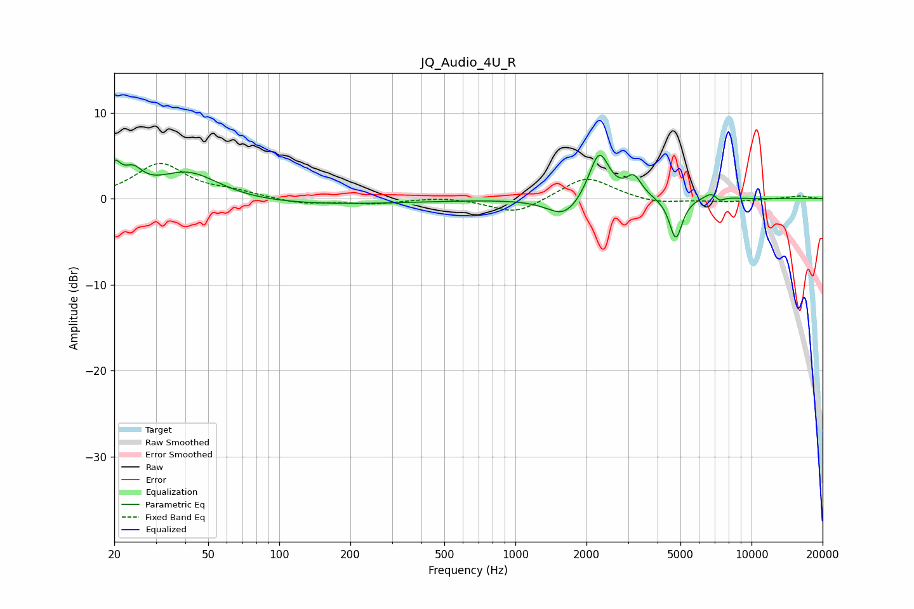

# JQ_Audio_4U_R
See [usage instructions](https://github.com/jaakkopasanen/AutoEq#usage) for more options and info.

### Parametric EQs
Apply preamp of -5.2 dB when using parametric equalizer.

|   # | Type    |   Fc (Hz) |    Q |   Gain (dB) |
|-----|---------|-----------|------|-------------|
|   1 | Peaking |        20 | 5.22 |         2.9 |
|   2 | Peaking |        24 | 3.43 |         2.2 |
|   3 | Peaking |        41 | 1.04 |         3.5 |
|   4 | Peaking |       100 | 0.26 |        -0.8 |
|   5 | Peaking |      1618 | 1.99 |        -2.3 |
|   6 | Peaking |      2262 | 3.3  |         5.7 |
|   7 | Peaking |      3175 | 4.29 |         2.3 |
|   8 | Peaking |      4780 | 5.23 |        -4.8 |
|   9 | Peaking |      6959 | 3.78 |         1.3 |
|  10 | Peaking |      7269 | 5.86 |        -1.1 |

### Fixed Band EQs
When using fixed band (also called graphic) equalizer, apply preamp of **-4.2 dB** (if available) and set gains manually with these parameters.

|   # | Type    |   Fc (Hz) |    Q |   Gain (dB) |
|-----|---------|-----------|------|-------------|
|   1 | Peaking |        31 | 1.41 |         4   |
|   2 | Peaking |        62 | 1.41 |         0.7 |
|   3 | Peaking |       125 | 1.41 |        -0.6 |
|   4 | Peaking |       250 | 1.41 |        -0.6 |
|   5 | Peaking |       500 | 1.41 |         0.3 |
|   6 | Peaking |      1000 | 1.41 |        -1.8 |
|   7 | Peaking |      2000 | 1.41 |         2.7 |
|   8 | Peaking |      4000 | 1.41 |        -0.6 |
|   9 | Peaking |      8000 | 1.41 |        -0.3 |
|  10 | Peaking |     16000 | 1.41 |         0.3 |

### Graphs

