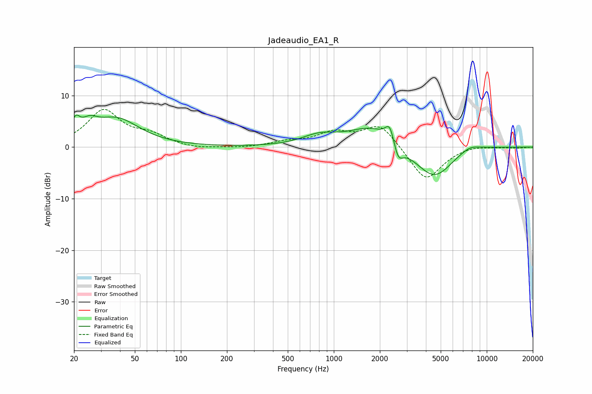

# Jadeaudio_EA1_R
See [usage instructions](https://github.com/jaakkopasanen/AutoEq#usage) for more options and info.

### Parametric EQs
Apply preamp of -6.3 dB when using parametric equalizer.

|   # | Type    |   Fc (Hz) |    Q |   Gain (dB) |
|-----|---------|-----------|------|-------------|
|   1 | Peaking |        21 | 5.42 |         2.9 |
|   2 | Peaking |        25 | 2.66 |         2.4 |
|   3 | Peaking |        38 | 0.94 |         5.3 |
|   4 | Peaking |       806 | 1.22 |         1.9 |
|   5 | Peaking |      1774 | 0.95 |         4   |
|   6 | Peaking |      2327 | 4.79 |         3.7 |
|   7 | Peaking |      2627 | 4.47 |        -3.4 |
|   8 | Peaking |      4582 | 1.04 |        -7.3 |
|   9 | Peaking |      6584 | 0.79 |         1.7 |
|  10 | Peaking |      7796 | 2.4  |         0.7 |

### Fixed Band EQs
When using fixed band (also called graphic) equalizer, apply preamp of **-7.4 dB** (if available) and set gains manually with these parameters.

|   # | Type    |   Fc (Hz) |    Q |   Gain (dB) |
|-----|---------|-----------|------|-------------|
|   1 | Peaking |        31 | 1.41 |         7   |
|   2 | Peaking |        62 | 1.41 |         2   |
|   3 | Peaking |       125 | 1.41 |        -0.4 |
|   4 | Peaking |       250 | 1.41 |        -0.2 |
|   5 | Peaking |       500 | 1.41 |         0.9 |
|   6 | Peaking |      1000 | 1.41 |         2.5 |
|   7 | Peaking |      2000 | 1.41 |         4.6 |
|   8 | Peaking |      4000 | 1.41 |        -6.7 |
|   9 | Peaking |      8000 | 1.41 |         0.5 |
|  10 | Peaking |     16000 | 1.41 |        -0.1 |

### Graphs

