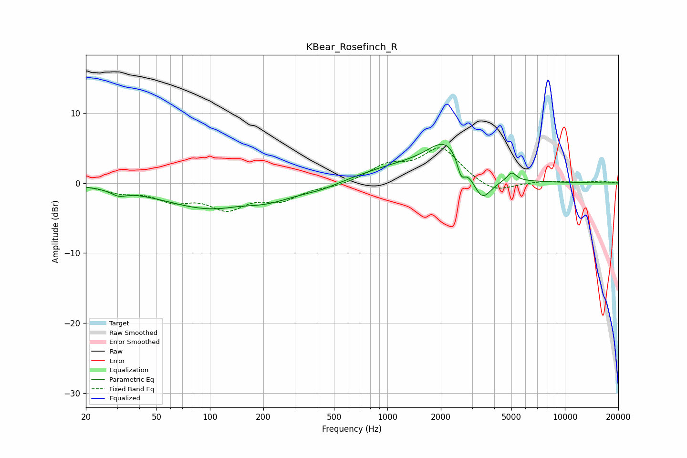

# KBear_Rosefinch_R
See [usage instructions](https://github.com/jaakkopasanen/AutoEq#usage) for more options and info.

### Parametric EQs
Apply preamp of -5.6 dB when using parametric equalizer.

|   # | Type    |   Fc (Hz) |    Q |   Gain (dB) |
|-----|---------|-----------|------|-------------|
|   1 | Peaking |        31 | 3.3  |        -0.8 |
|   2 | Peaking |       106 | 0.49 |        -3.7 |
|   3 | Peaking |       145 | 1.58 |         0.4 |
|   4 | Peaking |       220 | 0.92 |        -0.9 |
|   5 | Peaking |       423 | 1.42 |        -0.6 |
|   6 | Peaking |      1118 | 0.62 |         1.9 |
|   7 | Peaking |      2184 | 1.24 |         5.4 |
|   8 | Peaking |      2603 | 5.99 |        -2.7 |
|   9 | Peaking |      3401 | 2.49 |        -4.3 |
|  10 | Peaking |      5018 | 5.5  |         1.2 |

### Fixed Band EQs
When using fixed band (also called graphic) equalizer, apply preamp of **-5.1 dB** (if available) and set gains manually with these parameters.

|   # | Type    |   Fc (Hz) |    Q |   Gain (dB) |
|-----|---------|-----------|------|-------------|
|   1 | Peaking |        31 | 1.41 |        -1.1 |
|   2 | Peaking |        62 | 1.41 |        -2.1 |
|   3 | Peaking |       125 | 1.41 |        -3.3 |
|   4 | Peaking |       250 | 1.41 |        -2.1 |
|   5 | Peaking |       500 | 1.41 |        -0.5 |
|   6 | Peaking |      1000 | 1.41 |         2.2 |
|   7 | Peaking |      2000 | 1.41 |         4.9 |
|   8 | Peaking |      4000 | 1.41 |        -1.6 |
|   9 | Peaking |      8000 | 1.41 |         0.3 |
|  10 | Peaking |     16000 | 1.41 |         0.3 |

### Graphs

