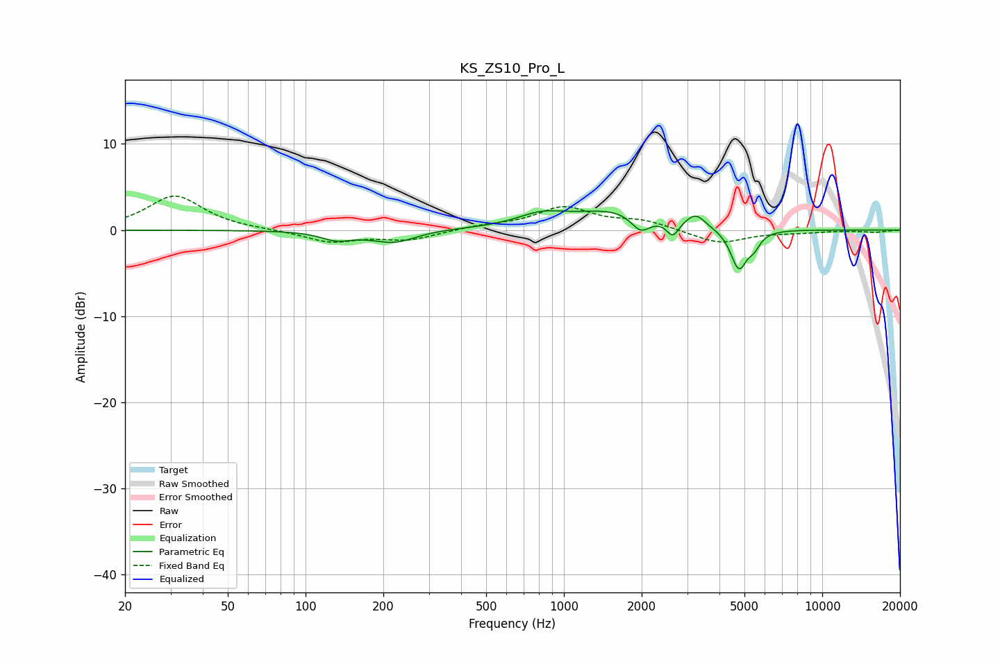

# KS_ZS10_Pro_L
See [usage instructions](https://github.com/jaakkopasanen/AutoEq#usage) for more options and info.

### Parametric EQs
Apply preamp of -2.3 dB when using parametric equalizer.

|   # | Type    |   Fc (Hz) |    Q |   Gain (dB) |
|-----|---------|-----------|------|-------------|
|   1 | Peaking |       132 | 2.37 |        -1   |
|   2 | Peaking |       220 | 1.55 |        -1.5 |
|   3 | Peaking |       288 | 1    |         0.2 |
|   4 | Peaking |       814 | 1.53 |         1.3 |
|   5 | Peaking |      1615 | 0.82 |         2.3 |
|   6 | Peaking |      1982 | 3.69 |        -2   |
|   7 | Peaking |      2639 | 6    |        -1.8 |
|   8 | Peaking |      3237 | 3.97 |         1.4 |
|   9 | Peaking |      4756 | 4.38 |        -4.6 |
|  10 | Peaking |      5454 | 6    |        -1.3 |

### Fixed Band EQs
When using fixed band (also called graphic) equalizer, apply preamp of **-4.0 dB** (if available) and set gains manually with these parameters.

|   # | Type    |   Fc (Hz) |    Q |   Gain (dB) |
|-----|---------|-----------|------|-------------|
|   1 | Peaking |        31 | 1.41 |         4   |
|   2 | Peaking |        62 | 1.41 |         0   |
|   3 | Peaking |       125 | 1.41 |        -1.4 |
|   4 | Peaking |       250 | 1.41 |        -1.1 |
|   5 | Peaking |       500 | 1.41 |         0.4 |
|   6 | Peaking |      1000 | 1.41 |         2.6 |
|   7 | Peaking |      2000 | 1.41 |         1   |
|   8 | Peaking |      4000 | 1.41 |        -1.6 |
|   9 | Peaking |      8000 | 1.41 |        -0.2 |
|  10 | Peaking |     16000 | 1.41 |        -0.2 |

### Graphs

