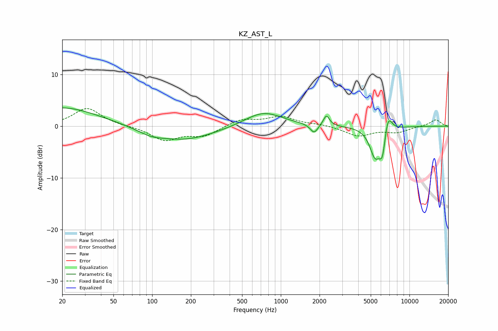

# KZ_AST_L
See [usage instructions](https://github.com/jaakkopasanen/AutoEq#usage) for more options and info.

### Parametric EQs
Apply preamp of -3.6 dB when using parametric equalizer.

|   # | Type    |   Fc (Hz) |    Q |   Gain (dB) |
|-----|---------|-----------|------|-------------|
|   1 | Peaking |        20 | 0.51 |         3.7 |
|   2 | Peaking |        97 | 1.45 |        -0.9 |
|   3 | Peaking |       177 | 0.6  |        -2.6 |
|   4 | Peaking |       731 | 0.98 |         2.9 |
|   5 | Peaking |      1814 | 4.79 |        -1.8 |
|   6 | Peaking |      2261 | 6    |         2.1 |
|   7 | Peaking |      5408 | 3.23 |        -5.7 |
|   8 | Peaking |      6151 | 6    |        -4.2 |
|   9 | Peaking |      6766 | 5.86 |         2.7 |
|  10 | Peaking |      7132 | 4.86 |         1.1 |

### Fixed Band EQs
When using fixed band (also called graphic) equalizer, apply preamp of **-3.5 dB** (if available) and set gains manually with these parameters.

|   # | Type    |   Fc (Hz) |    Q |   Gain (dB) |
|-----|---------|-----------|------|-------------|
|   1 | Peaking |        31 | 1.41 |         3.5 |
|   2 | Peaking |        62 | 1.41 |        -0   |
|   3 | Peaking |       125 | 1.41 |        -2.6 |
|   4 | Peaking |       250 | 1.41 |        -1.8 |
|   5 | Peaking |       500 | 1.41 |         1.3 |
|   6 | Peaking |      1000 | 1.41 |         1.8 |
|   7 | Peaking |      2000 | 1.41 |         0.3 |
|   8 | Peaking |      4000 | 1.41 |        -1.9 |
|   9 | Peaking |      8000 | 1.41 |        -1.1 |
|  10 | Peaking |     16000 | 1.41 |         1.3 |

### Graphs

