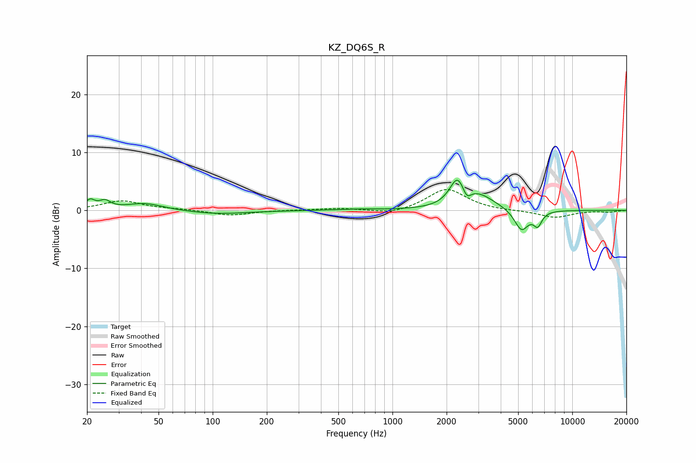

# KZ_DQ6S_R
See [usage instructions](https://github.com/jaakkopasanen/AutoEq#usage) for more options and info.

### Parametric EQs
Apply preamp of -5.3 dB when using parametric equalizer.

|   # | Type    |   Fc (Hz) |    Q |   Gain (dB) |
|-----|---------|-----------|------|-------------|
|   1 | Peaking |        21 | 5.61 |         1.5 |
|   2 | Peaking |        25 | 4.53 |         1.3 |
|   3 | Peaking |        42 | 1.39 |         1.2 |
|   4 | Peaking |       106 | 0.87 |        -0.6 |
|   5 | Peaking |       632 | 1.34 |         0.2 |
|   6 | Peaking |      2298 | 3.39 |         4.4 |
|   7 | Peaking |      2586 | 6    |        -1.9 |
|   8 | Peaking |      2995 | 1.49 |         2.5 |
|   9 | Peaking |      5217 | 3.51 |        -3.7 |
|  10 | Peaking |      6422 | 5.99 |        -2.3 |

### Fixed Band EQs
When using fixed band (also called graphic) equalizer, apply preamp of **-3.7 dB** (if available) and set gains manually with these parameters.

|   # | Type    |   Fc (Hz) |    Q |   Gain (dB) |
|-----|---------|-----------|------|-------------|
|   1 | Peaking |        31 | 1.41 |         1.6 |
|   2 | Peaking |        62 | 1.41 |         0.2 |
|   3 | Peaking |       125 | 1.41 |        -0.9 |
|   4 | Peaking |       250 | 1.41 |         0   |
|   5 | Peaking |       500 | 1.41 |         0.4 |
|   6 | Peaking |      1000 | 1.41 |        -0.7 |
|   7 | Peaking |      2000 | 1.41 |         3.8 |
|   8 | Peaking |      4000 | 1.41 |        -0.1 |
|   9 | Peaking |      8000 | 1.41 |        -1.2 |
|  10 | Peaking |     16000 | 1.41 |        -0.3 |

### Graphs

