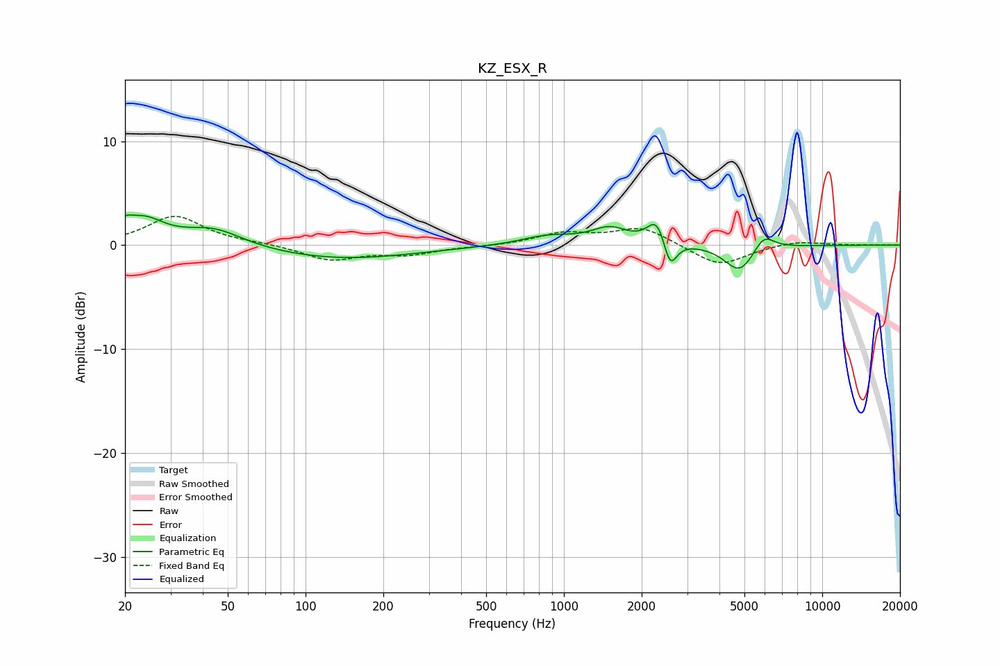

# KZ_ESX_R
See [usage instructions](https://github.com/jaakkopasanen/AutoEq#usage) for more options and info.

### Parametric EQs
Apply preamp of -3.0 dB when using parametric equalizer.

|   # | Type    |   Fc (Hz) |    Q |   Gain (dB) |
|-----|---------|-----------|------|-------------|
|   1 | Peaking |        20 | 5.45 |         0.8 |
|   2 | Peaking |        23 | 1.74 |         2.4 |
|   3 | Peaking |        44 | 1.26 |         1.7 |
|   4 | Peaking |       136 | 0.49 |        -1.3 |
|   5 | Peaking |       869 | 1.35 |         0.9 |
|   6 | Peaking |      1504 | 2.01 |         1.5 |
|   7 | Peaking |      2296 | 3.94 |         2.6 |
|   8 | Peaking |      2574 | 5.49 |        -2.9 |
|   9 | Peaking |      4796 | 2.43 |        -2.7 |
|  10 | Peaking |      5936 | 3.47 |         1.6 |

### Fixed Band EQs
When using fixed band (also called graphic) equalizer, apply preamp of **-2.9 dB** (if available) and set gains manually with these parameters.

|   # | Type    |   Fc (Hz) |    Q |   Gain (dB) |
|-----|---------|-----------|------|-------------|
|   1 | Peaking |        31 | 1.41 |         2.8 |
|   2 | Peaking |        62 | 1.41 |         0.1 |
|   3 | Peaking |       125 | 1.41 |        -1.4 |
|   4 | Peaking |       250 | 1.41 |        -0.8 |
|   5 | Peaking |       500 | 1.41 |        -0.1 |
|   6 | Peaking |      1000 | 1.41 |         1.1 |
|   7 | Peaking |      2000 | 1.41 |         1.7 |
|   8 | Peaking |      4000 | 1.41 |        -2.1 |
|   9 | Peaking |      8000 | 1.41 |         0.4 |
|  10 | Peaking |     16000 | 1.41 |         0   |

### Graphs

