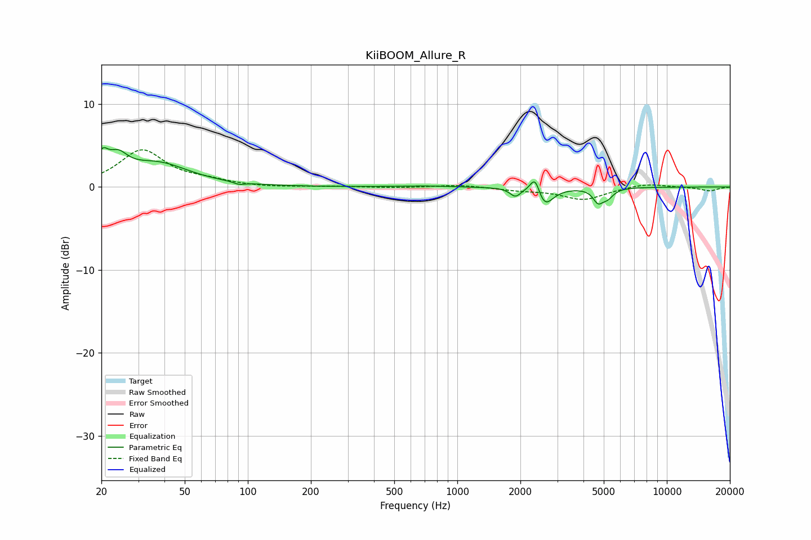

# KiiBOOM_Allure_R
See [usage instructions](https://github.com/jaakkopasanen/AutoEq#usage) for more options and info.

### Parametric EQs
Apply preamp of -4.8 dB when using parametric equalizer.

|   # | Type    |   Fc (Hz) |    Q |   Gain (dB) |
|-----|---------|-----------|------|-------------|
|   1 | Peaking |        20 | 5.25 |         2.4 |
|   2 | Peaking |        24 | 2.98 |         2.3 |
|   3 | Peaking |        37 | 0.94 |         2.7 |
|   4 | Peaking |        91 | 5.93 |        -0.3 |
|   5 | Peaking |       679 | 1.21 |         0.1 |
|   6 | Peaking |      1892 | 5.71 |        -1   |
|   7 | Peaking |      2354 | 6    |         2.4 |
|   8 | Peaking |      2592 | 3.56 |        -2.5 |
|   9 | Peaking |      4696 | 6    |        -1.5 |
|  10 | Peaking |      5217 | 5.07 |        -1   |

### Fixed Band EQs
When using fixed band (also called graphic) equalizer, apply preamp of **-4.6 dB** (if available) and set gains manually with these parameters.

|   # | Type    |   Fc (Hz) |    Q |   Gain (dB) |
|-----|---------|-----------|------|-------------|
|   1 | Peaking |        31 | 1.41 |         4.4 |
|   2 | Peaking |        62 | 1.41 |         0.6 |
|   3 | Peaking |       125 | 1.41 |        -0.1 |
|   4 | Peaking |       250 | 1.41 |         0.1 |
|   5 | Peaking |       500 | 1.41 |        -0.1 |
|   6 | Peaking |      1000 | 1.41 |         0.3 |
|   7 | Peaking |      2000 | 1.41 |        -0.3 |
|   8 | Peaking |      4000 | 1.41 |        -1.5 |
|   9 | Peaking |      8000 | 1.41 |         0.5 |
|  10 | Peaking |     16000 | 1.41 |        -0.5 |

### Graphs

