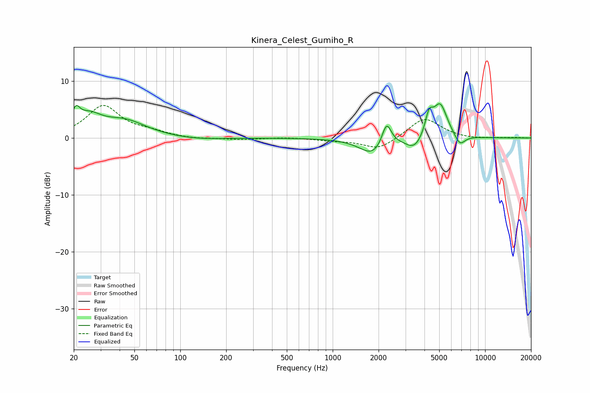

# Kinera_Celest_Gumiho_R
See [usage instructions](https://github.com/jaakkopasanen/AutoEq#usage) for more options and info.

### Parametric EQs
Apply preamp of -6.1 dB when using parametric equalizer.

|   # | Type    |   Fc (Hz) |    Q |   Gain (dB) |
|-----|---------|-----------|------|-------------|
|   1 | Peaking |        21 | 5.41 |         2.7 |
|   2 | Peaking |        25 | 1.68 |         3.1 |
|   3 | Peaking |        43 | 1    |         2.8 |
|   4 | Peaking |       128 | 0.88 |        -0.4 |
|   5 | Peaking |      1839 | 1.67 |        -3   |
|   6 | Peaking |      2257 | 4.53 |         4.2 |
|   7 | Peaking |      3446 | 2.54 |        -2.2 |
|   8 | Peaking |      4289 | 5.43 |         3.5 |
|   9 | Peaking |      5068 | 2.95 |         6   |
|  10 | Peaking |      6824 | 4.01 |        -1.9 |

### Fixed Band EQs
When using fixed band (also called graphic) equalizer, apply preamp of **-5.8 dB** (if available) and set gains manually with these parameters.

|   # | Type    |   Fc (Hz) |    Q |   Gain (dB) |
|-----|---------|-----------|------|-------------|
|   1 | Peaking |        31 | 1.41 |         5.6 |
|   2 | Peaking |        62 | 1.41 |         0.9 |
|   3 | Peaking |       125 | 1.41 |        -0.2 |
|   4 | Peaking |       250 | 1.41 |        -0.3 |
|   5 | Peaking |       500 | 1.41 |         0.1 |
|   6 | Peaking |      1000 | 1.41 |        -0.4 |
|   7 | Peaking |      2000 | 1.41 |        -2.1 |
|   8 | Peaking |      4000 | 1.41 |         3.6 |
|   9 | Peaking |      8000 | 1.41 |        -0.2 |
|  10 | Peaking |     16000 | 1.41 |         0.1 |

### Graphs

