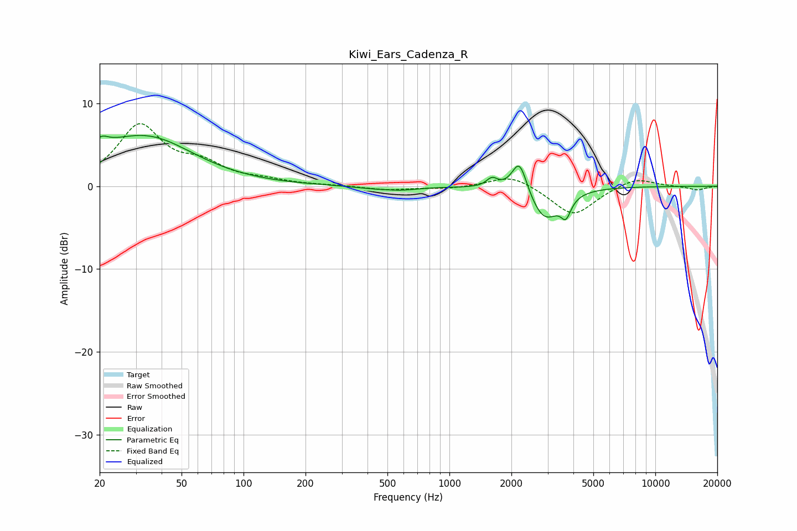

# Kiwi_Ears_Cadenza_R
See [usage instructions](https://github.com/jaakkopasanen/AutoEq#usage) for more options and info.

### Parametric EQs
Apply preamp of -6.2 dB when using parametric equalizer.

|   # | Type    |   Fc (Hz) |    Q |   Gain (dB) |
|-----|---------|-----------|------|-------------|
|   1 | Peaking |        20 | 5.8  |        -2.6 |
|   2 | Peaking |        20 | 5.06 |         3.8 |
|   3 | Peaking |        20 | 0.66 |         1.7 |
|   4 | Peaking |        36 | 0.64 |         4.9 |
|   5 | Peaking |       413 | 1.54 |        -0.2 |
|   6 | Peaking |       581 | 1.6  |        -0.4 |
|   7 | Peaking |      1611 | 5.21 |         1.1 |
|   8 | Peaking |      2189 | 3.86 |         4.1 |
|   9 | Peaking |      2898 | 1.96 |        -4.1 |
|  10 | Peaking |      3681 | 5.96 |        -2.1 |

### Fixed Band EQs
When using fixed band (also called graphic) equalizer, apply preamp of **-7.7 dB** (if available) and set gains manually with these parameters.

|   # | Type    |   Fc (Hz) |    Q |   Gain (dB) |
|-----|---------|-----------|------|-------------|
|   1 | Peaking |        31 | 1.41 |         7.1 |
|   2 | Peaking |        62 | 1.41 |         2.2 |
|   3 | Peaking |       125 | 1.41 |         0.6 |
|   4 | Peaking |       250 | 1.41 |         0.1 |
|   5 | Peaking |       500 | 1.41 |        -0.5 |
|   6 | Peaking |      1000 | 1.41 |        -0.3 |
|   7 | Peaking |      2000 | 1.41 |         1.5 |
|   8 | Peaking |      4000 | 1.41 |        -3.6 |
|   9 | Peaking |      8000 | 1.41 |         1.1 |
|  10 | Peaking |     16000 | 1.41 |        -0.5 |

### Graphs

