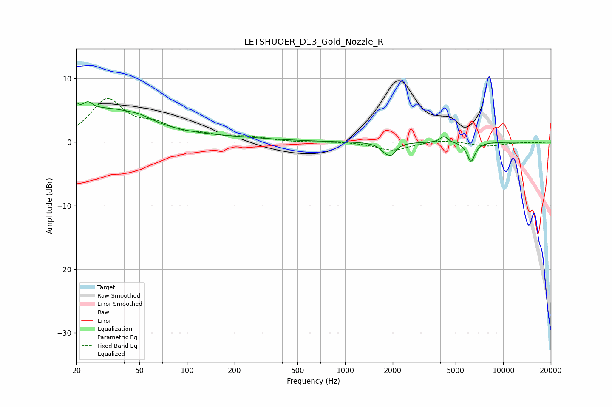

# LETSHUOER_D13_Gold_Nozzle_R
See [usage instructions](https://github.com/jaakkopasanen/AutoEq#usage) for more options and info.

### Parametric EQs
Apply preamp of -6.5 dB when using parametric equalizer.

|   # | Type    |   Fc (Hz) |    Q |   Gain (dB) |
|-----|---------|-----------|------|-------------|
|   1 | Peaking |        20 | 5.8  |         5   |
|   2 | Peaking |        20 | 5.92 |        -3.3 |
|   3 | Peaking |        24 | 4.59 |         1.4 |
|   4 | Peaking |        30 | 0.56 |         4.9 |
|   5 | Peaking |        50 | 1.97 |         0.5 |
|   6 | Peaking |       170 | 0.46 |         0.6 |
|   7 | Peaking |      1821 | 3.93 |        -1.4 |
|   8 | Peaking |      1988 | 5.84 |        -1   |
|   9 | Peaking |      4224 | 6    |         1   |
|  10 | Peaking |      6262 | 5.64 |        -3   |

### Fixed Band EQs
When using fixed band (also called graphic) equalizer, apply preamp of **-7.0 dB** (if available) and set gains manually with these parameters.

|   # | Type    |   Fc (Hz) |    Q |   Gain (dB) |
|-----|---------|-----------|------|-------------|
|   1 | Peaking |        31 | 1.41 |         6.4 |
|   2 | Peaking |        62 | 1.41 |         2.1 |
|   3 | Peaking |       125 | 1.41 |         0.8 |
|   4 | Peaking |       250 | 1.41 |         0.7 |
|   5 | Peaking |       500 | 1.41 |        -0   |
|   6 | Peaking |      1000 | 1.41 |         0.1 |
|   7 | Peaking |      2000 | 1.41 |        -1.3 |
|   8 | Peaking |      4000 | 1.41 |         0.4 |
|   9 | Peaking |      8000 | 1.41 |        -0.6 |
|  10 | Peaking |     16000 | 1.41 |        -0.1 |

### Graphs

