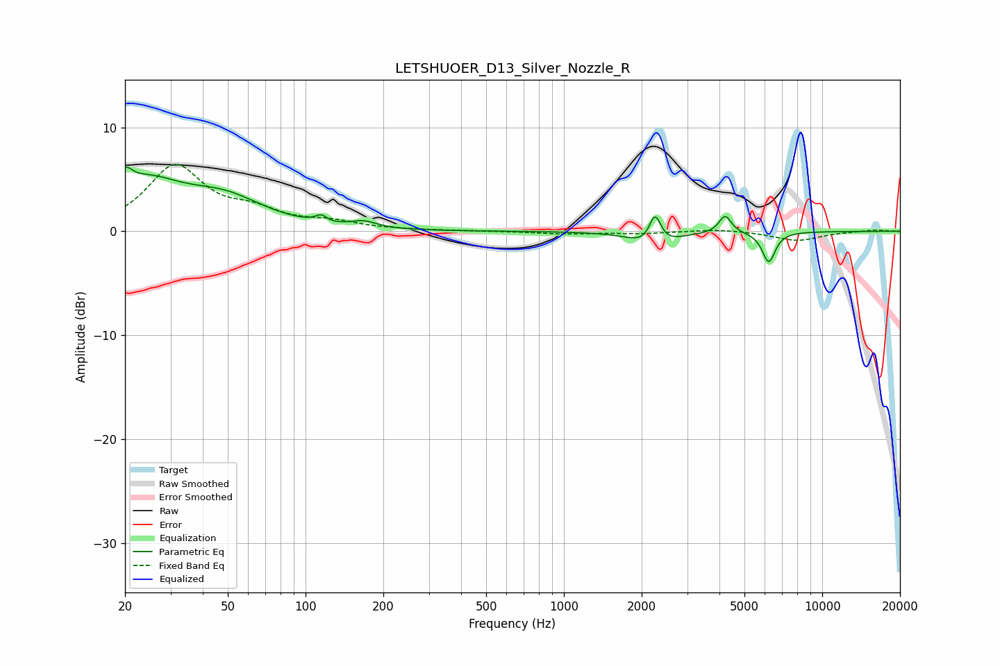

# LETSHUOER_D13_Silver_Nozzle_R
See [usage instructions](https://github.com/jaakkopasanen/AutoEq#usage) for more options and info.

### Parametric EQs
Apply preamp of -6.3 dB when using parametric equalizer.

|   # | Type    |   Fc (Hz) |    Q |   Gain (dB) |
|-----|---------|-----------|------|-------------|
|   1 | Peaking |        20 | 5.42 |         1.7 |
|   2 | Peaking |        24 | 0.96 |         4.3 |
|   3 | Peaking |        49 | 0.93 |         2.6 |
|   4 | Peaking |       117 | 5.82 |         1.3 |
|   5 | Peaking |       119 | 5.67 |        -0.7 |
|   6 | Peaking |       168 | 2.87 |         0.6 |
|   7 | Peaking |      2228 | 1.97 |        -1.7 |
|   8 | Peaking |      2255 | 6    |         3.1 |
|   9 | Peaking |      4208 | 5.98 |         1.7 |
|  10 | Peaking |      6207 | 5.5  |        -2.9 |

### Fixed Band EQs
When using fixed band (also called graphic) equalizer, apply preamp of **-6.5 dB** (if available) and set gains manually with these parameters.

|   # | Type    |   Fc (Hz) |    Q |   Gain (dB) |
|-----|---------|-----------|------|-------------|
|   1 | Peaking |        31 | 1.41 |         6.1 |
|   2 | Peaking |        62 | 1.41 |         1.5 |
|   3 | Peaking |       125 | 1.41 |         0.7 |
|   4 | Peaking |       250 | 1.41 |         0.1 |
|   5 | Peaking |       500 | 1.41 |         0   |
|   6 | Peaking |      1000 | 1.41 |        -0.2 |
|   7 | Peaking |      2000 | 1.41 |        -0.2 |
|   8 | Peaking |      4000 | 1.41 |         0.2 |
|   9 | Peaking |      8000 | 1.41 |        -0.9 |
|  10 | Peaking |     16000 | 1.41 |         0.2 |

### Graphs

