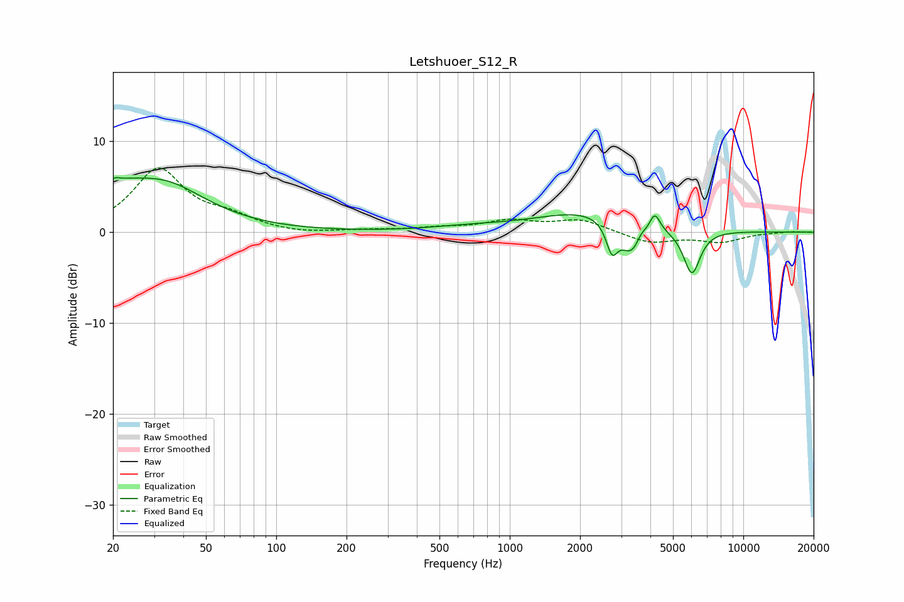

# Letshuoer_S12_R
See [usage instructions](https://github.com/jaakkopasanen/AutoEq#usage) for more options and info.

### Parametric EQs
Apply preamp of -6.1 dB when using parametric equalizer.

|   # | Type    |   Fc (Hz) |    Q |   Gain (dB) |
|-----|---------|-----------|------|-------------|
|   1 | Peaking |        20 | 5.34 |         1.1 |
|   2 | Peaking |        22 | 1.68 |         1.7 |
|   3 | Peaking |        33 | 0.77 |         5.1 |
|   4 | Peaking |       666 | 0.83 |         0.4 |
|   5 | Peaking |      2238 | 0.64 |         2.4 |
|   6 | Peaking |      2739 | 5.78 |        -3.1 |
|   7 | Peaking |      3345 | 2.71 |        -3.9 |
|   8 | Peaking |      3641 | 5.94 |         1.1 |
|   9 | Peaking |      4175 | 6    |         2.2 |
|  10 | Peaking |      6021 | 3.81 |        -5   |

### Fixed Band EQs
When using fixed band (also called graphic) equalizer, apply preamp of **-7.2 dB** (if available) and set gains manually with these parameters.

|   # | Type    |   Fc (Hz) |    Q |   Gain (dB) |
|-----|---------|-----------|------|-------------|
|   1 | Peaking |        31 | 1.41 |         6.8 |
|   2 | Peaking |        62 | 1.41 |         1.3 |
|   3 | Peaking |       125 | 1.41 |        -0.3 |
|   4 | Peaking |       250 | 1.41 |         0.2 |
|   5 | Peaking |       500 | 1.41 |         0.4 |
|   6 | Peaking |      1000 | 1.41 |         1.2 |
|   7 | Peaking |      2000 | 1.41 |         1.3 |
|   8 | Peaking |      4000 | 1.41 |        -1.2 |
|   9 | Peaking |      8000 | 1.41 |        -1   |
|  10 | Peaking |     16000 | 1.41 |         0.1 |

### Graphs

