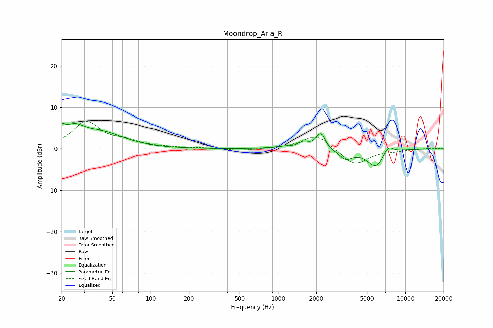

# Moondrop_Aria_R
See [usage instructions](https://github.com/jaakkopasanen/AutoEq#usage) for more options and info.

### Parametric EQs
Apply preamp of -6.3 dB when using parametric equalizer.

|   # | Type    |   Fc (Hz) |    Q |   Gain (dB) |
|-----|---------|-----------|------|-------------|
|   1 | Peaking |        20 | 5.95 |         2.3 |
|   2 | Peaking |        25 | 1.71 |         3.9 |
|   3 | Peaking |        42 | 0.84 |         3.5 |
|   4 | Peaking |      1076 | 1.84 |         0.5 |
|   5 | Peaking |      1589 | 3.36 |         1.4 |
|   6 | Peaking |      2122 | 4.2  |         3.1 |
|   7 | Peaking |      2252 | 6    |         1   |
|   8 | Peaking |      3396 | 2.6  |        -2.2 |
|   9 | Peaking |      5854 | 2.07 |        -4.3 |
|  10 | Peaking |      7342 | 3.51 |         2.1 |

### Fixed Band EQs
When using fixed band (also called graphic) equalizer, apply preamp of **-6.7 dB** (if available) and set gains manually with these parameters.

|   # | Type    |   Fc (Hz) |    Q |   Gain (dB) |
|-----|---------|-----------|------|-------------|
|   1 | Peaking |        31 | 1.41 |         6.3 |
|   2 | Peaking |        62 | 1.41 |         1.5 |
|   3 | Peaking |       125 | 1.41 |         0.3 |
|   4 | Peaking |       250 | 1.41 |         0.2 |
|   5 | Peaking |       500 | 1.41 |        -0.5 |
|   6 | Peaking |      1000 | 1.41 |         0.1 |
|   7 | Peaking |      2000 | 1.41 |         3.5 |
|   8 | Peaking |      4000 | 1.41 |        -4   |
|   9 | Peaking |      8000 | 1.41 |        -0.4 |
|  10 | Peaking |     16000 | 1.41 |         0.2 |

### Graphs

