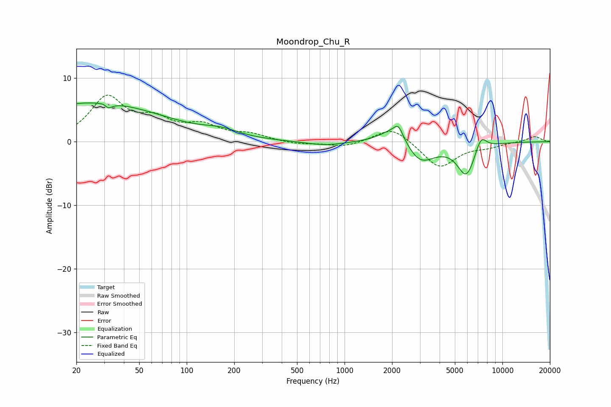

# Moondrop_Chu_R
See [usage instructions](https://github.com/jaakkopasanen/AutoEq#usage) for more options and info.

### Parametric EQs
Apply preamp of -6.2 dB when using parametric equalizer.

|   # | Type    |   Fc (Hz) |    Q |   Gain (dB) |
|-----|---------|-----------|------|-------------|
|   1 | Peaking |        26 | 0.31 |         6.2 |
|   2 | Peaking |        31 | 5.7  |         2.9 |
|   3 | Peaking |        31 | 5.52 |        -3.4 |
|   4 | Peaking |       165 | 1.26 |         1   |
|   5 | Peaking |       753 | 1.14 |        -0.6 |
|   6 | Peaking |      2087 | 1.56 |         2.8 |
|   7 | Peaking |      2195 | 5.13 |         1.7 |
|   8 | Peaking |      2987 | 1.51 |        -3.7 |
|   9 | Peaking |      5912 | 2.41 |        -5.2 |
|  10 | Peaking |      7311 | 3.74 |         2.5 |

### Fixed Band EQs
When using fixed band (also called graphic) equalizer, apply preamp of **-7.4 dB** (if available) and set gains manually with these parameters.

|   # | Type    |   Fc (Hz) |    Q |   Gain (dB) |
|-----|---------|-----------|------|-------------|
|   1 | Peaking |        31 | 1.41 |         6.7 |
|   2 | Peaking |        62 | 1.41 |         2.8 |
|   3 | Peaking |       125 | 1.41 |         2.2 |
|   4 | Peaking |       250 | 1.41 |         1   |
|   5 | Peaking |       500 | 1.41 |        -0.4 |
|   6 | Peaking |      1000 | 1.41 |        -0.8 |
|   7 | Peaking |      2000 | 1.41 |         2.5 |
|   8 | Peaking |      4000 | 1.41 |        -4.2 |
|   9 | Peaking |      8000 | 1.41 |        -0.7 |
|  10 | Peaking |     16000 | 1.41 |         0.9 |

### Graphs

