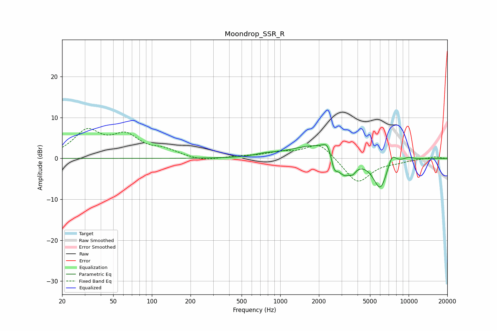

# Moondrop_SSR_R
See [usage instructions](https://github.com/jaakkopasanen/AutoEq#usage) for more options and info.

### Parametric EQs
Apply preamp of -3.5 dB when using parametric equalizer.

|   # | Type    |   Fc (Hz) |    Q |   Gain (dB) |
|-----|---------|-----------|------|-------------|
|   1 | Peaking |       766 | 1.76 |         0.6 |
|   2 | Peaking |      1441 | 0.95 |         1.3 |
|   3 | Peaking |      2289 | 0.99 |         3.4 |
|   4 | Peaking |      2331 | 4.62 |         2.3 |
|   5 | Peaking |      2630 | 6    |        -3.2 |
|   6 | Peaking |      3119 | 2.1  |        -5.8 |
|   7 | Peaking |      3671 | 6    |        -1.2 |
|   8 | Peaking |      6018 | 2.41 |        -7.7 |
|   9 | Peaking |      7401 | 3.89 |         3.1 |
|  10 | Peaking |     10000 | 3.11 |         0.6 |

### Fixed Band EQs
When using fixed band (also called graphic) equalizer, apply preamp of **-7.4 dB** (if available) and set gains manually with these parameters.

|   # | Type    |   Fc (Hz) |    Q |   Gain (dB) |
|-----|---------|-----------|------|-------------|
|   1 | Peaking |        31 | 1.41 |         6.3 |
|   2 | Peaking |        62 | 1.41 |         4.9 |
|   3 | Peaking |       125 | 1.41 |         1.7 |
|   4 | Peaking |       250 | 1.41 |        -0.8 |
|   5 | Peaking |       500 | 1.41 |         0.4 |
|   6 | Peaking |      1000 | 1.41 |         1.3 |
|   7 | Peaking |      2000 | 1.41 |         4   |
|   8 | Peaking |      4000 | 1.41 |        -6.2 |
|   9 | Peaking |      8000 | 1.41 |        -0.6 |
|  10 | Peaking |     16000 | 1.41 |         0.5 |

### Graphs

