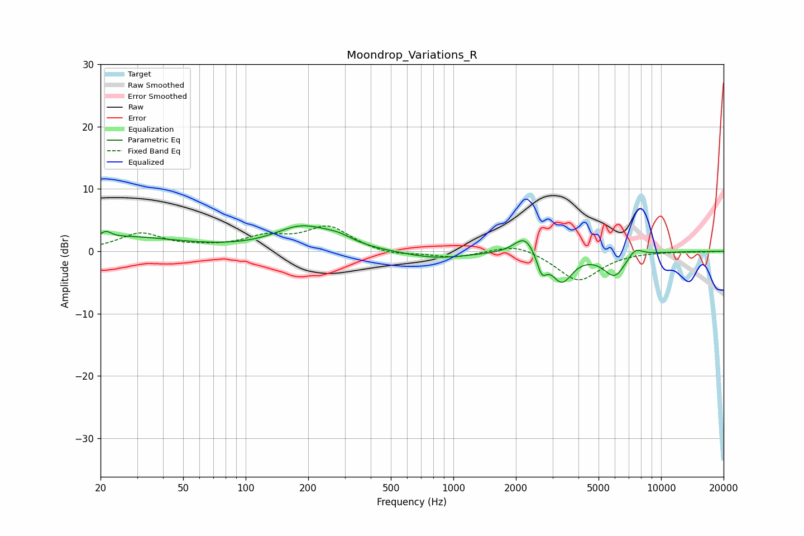

# Moondrop_Variations_R
See [usage instructions](https://github.com/jaakkopasanen/AutoEq#usage) for more options and info.

### Parametric EQs
Apply preamp of -4.2 dB when using parametric equalizer.

|   # | Type    |   Fc (Hz) |    Q |   Gain (dB) |
|-----|---------|-----------|------|-------------|
|   1 | Peaking |        21 | 5.93 |         1   |
|   2 | Peaking |        25 | 0.5  |         2.2 |
|   3 | Peaking |       187 | 1.06 |         3.7 |
|   4 | Peaking |       279 | 1.94 |         1.1 |
|   5 | Peaking |       826 | 0.93 |        -1.2 |
|   6 | Peaking |      2214 | 2.79 |         3.1 |
|   7 | Peaking |      2663 | 5.99 |        -3.1 |
|   8 | Peaking |      3330 | 2.77 |        -4.7 |
|   9 | Peaking |      5980 | 2.5  |        -3.9 |
|  10 | Peaking |      7482 | 3.66 |         1.5 |

### Fixed Band EQs
When using fixed band (also called graphic) equalizer, apply preamp of **-4.2 dB** (if available) and set gains manually with these parameters.

|   # | Type    |   Fc (Hz) |    Q |   Gain (dB) |
|-----|---------|-----------|------|-------------|
|   1 | Peaking |        31 | 1.41 |         2.8 |
|   2 | Peaking |        62 | 1.41 |         0.4 |
|   3 | Peaking |       125 | 1.41 |         2   |
|   4 | Peaking |       250 | 1.41 |         3.8 |
|   5 | Peaking |       500 | 1.41 |        -0.7 |
|   6 | Peaking |      1000 | 1.41 |        -1   |
|   7 | Peaking |      2000 | 1.41 |         1.4 |
|   8 | Peaking |      4000 | 1.41 |        -4.8 |
|   9 | Peaking |      8000 | 1.41 |         0   |
|  10 | Peaking |     16000 | 1.41 |        -0.1 |

### Graphs

