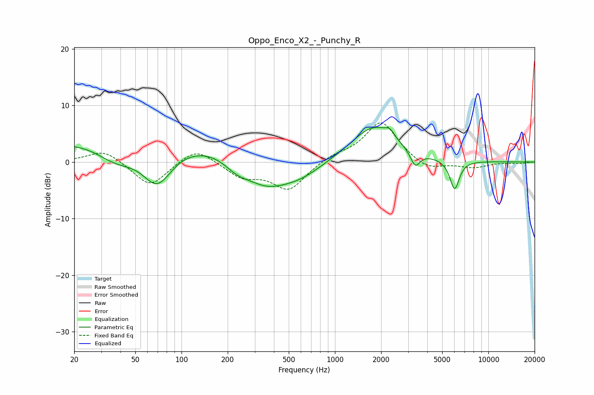

# Oppo_Enco_X2_-_Punchy_R
See [usage instructions](https://github.com/jaakkopasanen/AutoEq#usage) for more options and info.

### Parametric EQs
Apply preamp of -6.2 dB when using parametric equalizer.

|   # | Type    |   Fc (Hz) |    Q |   Gain (dB) |
|-----|---------|-----------|------|-------------|
|   1 | Peaking |        37 | 1.06 |        -3.4 |
|   2 | Peaking |        54 | 0.18 |         5   |
|   3 | Peaking |        69 | 1.37 |        -7.3 |
|   4 | Peaking |       229 | 1.73 |        -1.8 |
|   5 | Peaking |       353 | 0.92 |        -4.8 |
|   6 | Peaking |       596 | 0.96 |        -2.3 |
|   7 | Peaking |      1786 | 0.96 |         6.4 |
|   8 | Peaking |      2275 | 4.73 |         1.2 |
|   9 | Peaking |      3335 | 4.6  |        -2.8 |
|  10 | Peaking |      6020 | 4.46 |        -5.2 |

### Fixed Band EQs
When using fixed band (also called graphic) equalizer, apply preamp of **-7.0 dB** (if available) and set gains manually with these parameters.

|   # | Type    |   Fc (Hz) |    Q |   Gain (dB) |
|-----|---------|-----------|------|-------------|
|   1 | Peaking |        31 | 1.41 |         2.3 |
|   2 | Peaking |        62 | 1.41 |        -4.5 |
|   3 | Peaking |       125 | 1.41 |         2.8 |
|   4 | Peaking |       250 | 1.41 |        -2.5 |
|   5 | Peaking |       500 | 1.41 |        -4.8 |
|   6 | Peaking |      1000 | 1.41 |         1.1 |
|   7 | Peaking |      2000 | 1.41 |         7.2 |
|   8 | Peaking |      4000 | 1.41 |        -1.7 |
|   9 | Peaking |      8000 | 1.41 |        -1   |
|  10 | Peaking |     16000 | 1.41 |        -0.2 |

### Graphs

