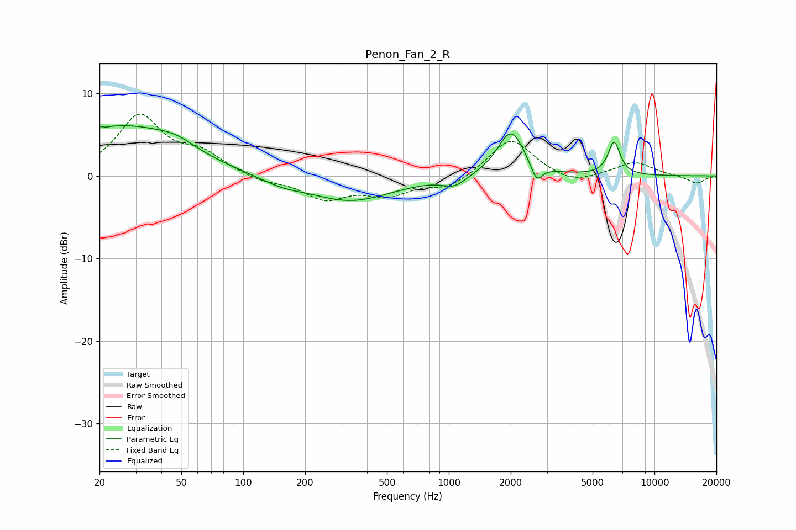

# Penon_Fan_2_R
See [usage instructions](https://github.com/jaakkopasanen/AutoEq#usage) for more options and info.

### Parametric EQs
Apply preamp of -6.2 dB when using parametric equalizer.

|   # | Type    |   Fc (Hz) |    Q |   Gain (dB) |
|-----|---------|-----------|------|-------------|
|   1 | Peaking |        21 | 5.42 |         3.5 |
|   2 | Peaking |        21 | 5.88 |        -3.1 |
|   3 | Peaking |        26 | 0.53 |         5.8 |
|   4 | Peaking |        47 | 1.45 |         1.1 |
|   5 | Peaking |       154 | 1.34 |        -0.8 |
|   6 | Peaking |       332 | 0.69 |        -3   |
|   7 | Peaking |      1065 | 2.56 |        -1.2 |
|   8 | Peaking |      2003 | 2.16 |         5.5 |
|   9 | Peaking |      2669 | 5.09 |        -2.2 |
|  10 | Peaking |      6359 | 4.78 |         4   |

### Fixed Band EQs
When using fixed band (also called graphic) equalizer, apply preamp of **-7.6 dB** (if available) and set gains manually with these parameters.

|   # | Type    |   Fc (Hz) |    Q |   Gain (dB) |
|-----|---------|-----------|------|-------------|
|   1 | Peaking |        31 | 1.41 |         7.1 |
|   2 | Peaking |        62 | 1.41 |         2.3 |
|   3 | Peaking |       125 | 1.41 |        -0.7 |
|   4 | Peaking |       250 | 1.41 |        -2.6 |
|   5 | Peaking |       500 | 1.41 |        -2.1 |
|   6 | Peaking |      1000 | 1.41 |        -1.5 |
|   7 | Peaking |      2000 | 1.41 |         4.7 |
|   8 | Peaking |      4000 | 1.41 |        -1.1 |
|   9 | Peaking |      8000 | 1.41 |         1.7 |
|  10 | Peaking |     16000 | 1.41 |        -0.9 |

### Graphs

