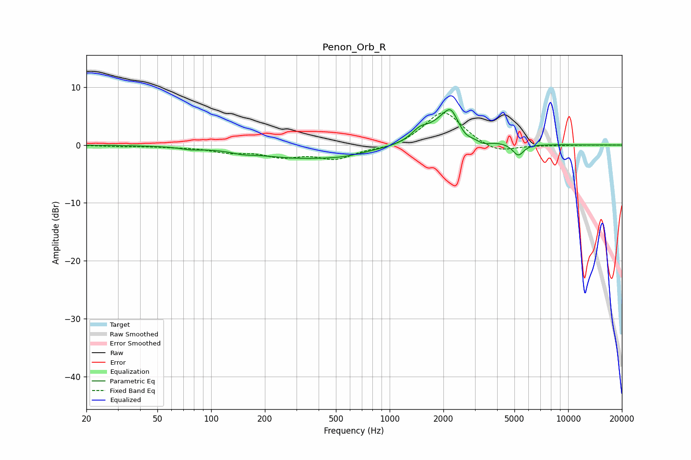

# Penon_Orb_R
See [usage instructions](https://github.com/jaakkopasanen/AutoEq#usage) for more options and info.

### Parametric EQs
Apply preamp of -6.2 dB when using parametric equalizer.

|   # | Type    |   Fc (Hz) |    Q |   Gain (dB) |
|-----|---------|-----------|------|-------------|
|   1 | Peaking |        77 | 2.56 |        -0.3 |
|   2 | Peaking |       149 | 2.87 |        -0.3 |
|   3 | Peaking |       336 | 0.46 |        -2.3 |
|   4 | Peaking |       559 | 1.49 |        -0.3 |
|   5 | Peaking |      1478 | 2.98 |         1.7 |
|   6 | Peaking |      2189 | 1.69 |         6.2 |
|   7 | Peaking |      2201 | 5.98 |         0.8 |
|   8 | Peaking |      2624 | 3.11 |        -2.1 |
|   9 | Peaking |      3342 | 3.55 |        -0.9 |
|  10 | Peaking |      5254 | 4.6  |        -2   |

### Fixed Band EQs
When using fixed band (also called graphic) equalizer, apply preamp of **-5.7 dB** (if available) and set gains manually with these parameters.

|   # | Type    |   Fc (Hz) |    Q |   Gain (dB) |
|-----|---------|-----------|------|-------------|
|   1 | Peaking |        31 | 1.41 |        -0.2 |
|   2 | Peaking |        62 | 1.41 |        -0.2 |
|   3 | Peaking |       125 | 1.41 |        -1   |
|   4 | Peaking |       250 | 1.41 |        -1.7 |
|   5 | Peaking |       500 | 1.41 |        -2.2 |
|   6 | Peaking |      1000 | 1.41 |        -0.7 |
|   7 | Peaking |      2000 | 1.41 |         6   |
|   8 | Peaking |      4000 | 1.41 |        -1.6 |
|   9 | Peaking |      8000 | 1.41 |        -0.1 |
|  10 | Peaking |     16000 | 1.41 |         0   |

### Graphs

