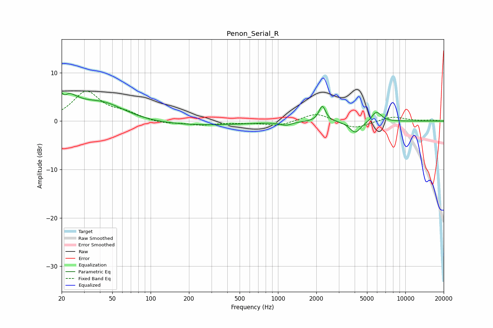

# Penon_Serial_R
See [usage instructions](https://github.com/jaakkopasanen/AutoEq#usage) for more options and info.

### Parametric EQs
Apply preamp of -6.0 dB when using parametric equalizer.

|   # | Type    |   Fc (Hz) |    Q |   Gain (dB) |
|-----|---------|-----------|------|-------------|
|   1 | Peaking |        20 | 1.61 |         6.3 |
|   2 | Peaking |        21 | 5.31 |        -5.4 |
|   3 | Peaking |        21 | 5.52 |         3.4 |
|   4 | Peaking |        42 | 0.8  |         3.5 |
|   5 | Peaking |       207 | 0.34 |        -0.9 |
|   6 | Peaking |      1157 | 3.24 |        -0.7 |
|   7 | Peaking |      2229 | 5.48 |         3.2 |
|   8 | Peaking |      4045 | 3.14 |        -2.4 |
|   9 | Peaking |      5674 | 5.98 |         0.5 |
|  10 | Peaking |      6025 | 3.8  |         1.8 |

### Fixed Band EQs
When using fixed band (also called graphic) equalizer, apply preamp of **-6.3 dB** (if available) and set gains manually with these parameters.

|   # | Type    |   Fc (Hz) |    Q |   Gain (dB) |
|-----|---------|-----------|------|-------------|
|   1 | Peaking |        31 | 1.41 |         6   |
|   2 | Peaking |        62 | 1.41 |         1.4 |
|   3 | Peaking |       125 | 1.41 |        -0.6 |
|   4 | Peaking |       250 | 1.41 |        -0.8 |
|   5 | Peaking |       500 | 1.41 |        -0.3 |
|   6 | Peaking |      1000 | 1.41 |        -1   |
|   7 | Peaking |      2000 | 1.41 |         1.8 |
|   8 | Peaking |      4000 | 1.41 |        -1.6 |
|   9 | Peaking |      8000 | 1.41 |         1   |
|  10 | Peaking |     16000 | 1.41 |         0.2 |

### Graphs

