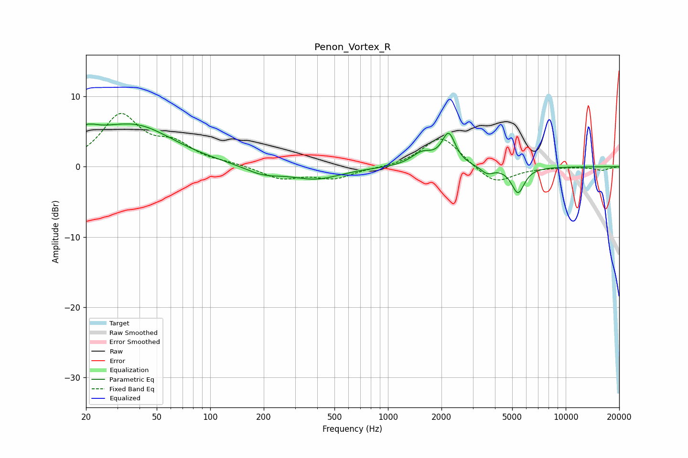

# Penon_Vortex_R
See [usage instructions](https://github.com/jaakkopasanen/AutoEq#usage) for more options and info.

### Parametric EQs
Apply preamp of -6.2 dB when using parametric equalizer.

|   # | Type    |   Fc (Hz) |    Q |   Gain (dB) |
|-----|---------|-----------|------|-------------|
|   1 | Peaking |        21 | 4.95 |         3.8 |
|   2 | Peaking |        21 | 5.79 |        -2.6 |
|   3 | Peaking |        21 | 1.24 |         1.7 |
|   4 | Peaking |        38 | 0.64 |         5.5 |
|   5 | Peaking |       198 | 1.39 |        -1.1 |
|   6 | Peaking |       392 | 1    |        -1.7 |
|   7 | Peaking |      1560 | 2.33 |         1.8 |
|   8 | Peaking |      2195 | 3.8  |         4.4 |
|   9 | Peaking |      3618 | 3.99 |        -1   |
|  10 | Peaking |      5391 | 3.83 |        -3.7 |

### Fixed Band EQs
When using fixed band (also called graphic) equalizer, apply preamp of **-7.7 dB** (if available) and set gains manually with these parameters.

|   # | Type    |   Fc (Hz) |    Q |   Gain (dB) |
|-----|---------|-----------|------|-------------|
|   1 | Peaking |        31 | 1.41 |         7.1 |
|   2 | Peaking |        62 | 1.41 |         2.7 |
|   3 | Peaking |       125 | 1.41 |         0.3 |
|   4 | Peaking |       250 | 1.41 |        -1.7 |
|   5 | Peaking |       500 | 1.41 |        -1.6 |
|   6 | Peaking |      1000 | 1.41 |        -0.1 |
|   7 | Peaking |      2000 | 1.41 |         4.5 |
|   8 | Peaking |      4000 | 1.41 |        -2.6 |
|   9 | Peaking |      8000 | 1.41 |        -0.1 |
|  10 | Peaking |     16000 | 1.41 |        -0.5 |

### Graphs

