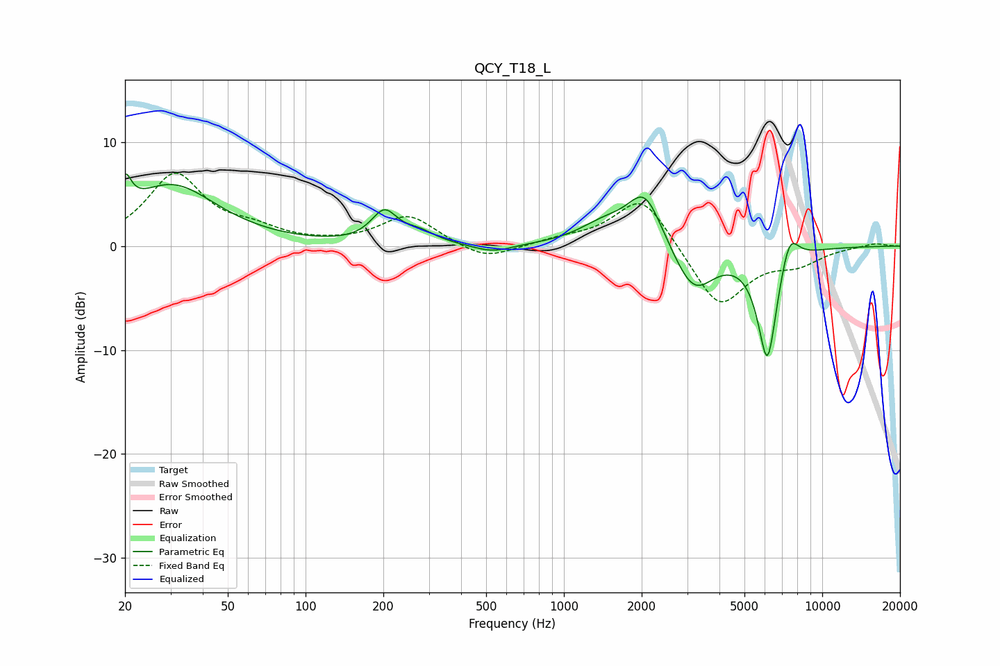

# QCY_T18_L
See [usage instructions](https://github.com/jaakkopasanen/AutoEq#usage) for more options and info.

### Parametric EQs
Apply preamp of -7.0 dB when using parametric equalizer.

|   # | Type    |   Fc (Hz) |    Q |   Gain (dB) |
|-----|---------|-----------|------|-------------|
|   1 | Peaking |        20 | 5.98 |         3.1 |
|   2 | Peaking |        30 | 0.81 |         5.8 |
|   3 | Peaking |       202 | 2.83 |         3   |
|   4 | Peaking |       275 | 2.26 |         1   |
|   5 | Peaking |       530 | 1.88 |        -0.8 |
|   6 | Peaking |      1433 | 1.41 |         1.8 |
|   7 | Peaking |      2059 | 2.07 |         5.1 |
|   8 | Peaking |      3175 | 1.77 |        -4.6 |
|   9 | Peaking |      6135 | 3.55 |       -11   |
|  10 | Peaking |      7457 | 3.76 |         3.3 |

### Fixed Band EQs
When using fixed band (also called graphic) equalizer, apply preamp of **-7.1 dB** (if available) and set gains manually with these parameters.

|   # | Type    |   Fc (Hz) |    Q |   Gain (dB) |
|-----|---------|-----------|------|-------------|
|   1 | Peaking |        31 | 1.41 |         6.8 |
|   2 | Peaking |        62 | 1.41 |         1.2 |
|   3 | Peaking |       125 | 1.41 |         0.1 |
|   4 | Peaking |       250 | 1.41 |         2.9 |
|   5 | Peaking |       500 | 1.41 |        -1.5 |
|   6 | Peaking |      1000 | 1.41 |         0.5 |
|   7 | Peaking |      2000 | 1.41 |         5.1 |
|   8 | Peaking |      4000 | 1.41 |        -6   |
|   9 | Peaking |      8000 | 1.41 |        -1.4 |
|  10 | Peaking |     16000 | 1.41 |         0.3 |

### Graphs

