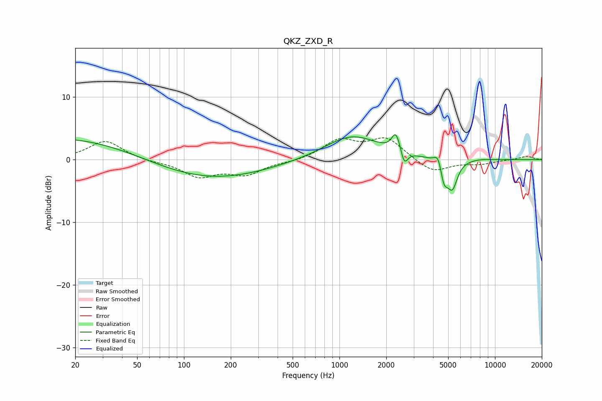

# QKZ_ZXD_R
See [usage instructions](https://github.com/jaakkopasanen/AutoEq#usage) for more options and info.

### Parametric EQs
Apply preamp of -4.1 dB when using parametric equalizer.

|   # | Type    |   Fc (Hz) |    Q |   Gain (dB) |
|-----|---------|-----------|------|-------------|
|   1 | Peaking |        20 | 0.26 |         3.8 |
|   2 | Peaking |       123 | 0.34 |        -3.6 |
|   3 | Peaking |      1204 | 0.81 |         3.9 |
|   4 | Peaking |      2296 | 5.66 |         2.5 |
|   5 | Peaking |      2491 | 4.48 |         1.3 |
|   6 | Peaking |      2597 | 6    |        -3.3 |
|   7 | Peaking |      4318 | 5.89 |         2   |
|   8 | Peaking |      4692 | 5.72 |        -3.3 |
|   9 | Peaking |      5317 | 4.23 |        -4.4 |
|  10 | Peaking |      8110 | 2.23 |         0.1 |

### Fixed Band EQs
When using fixed band (also called graphic) equalizer, apply preamp of **-3.6 dB** (if available) and set gains manually with these parameters.

|   # | Type    |   Fc (Hz) |    Q |   Gain (dB) |
|-----|---------|-----------|------|-------------|
|   1 | Peaking |        31 | 1.41 |         3   |
|   2 | Peaking |        62 | 1.41 |        -0.3 |
|   3 | Peaking |       125 | 1.41 |        -2.6 |
|   4 | Peaking |       250 | 1.41 |        -2.2 |
|   5 | Peaking |       500 | 1.41 |        -0.3 |
|   6 | Peaking |      1000 | 1.41 |         3   |
|   7 | Peaking |      2000 | 1.41 |         3.3 |
|   8 | Peaking |      4000 | 1.41 |        -2.1 |
|   9 | Peaking |      8000 | 1.41 |        -0.6 |
|  10 | Peaking |     16000 | 1.41 |         0.6 |

### Graphs

