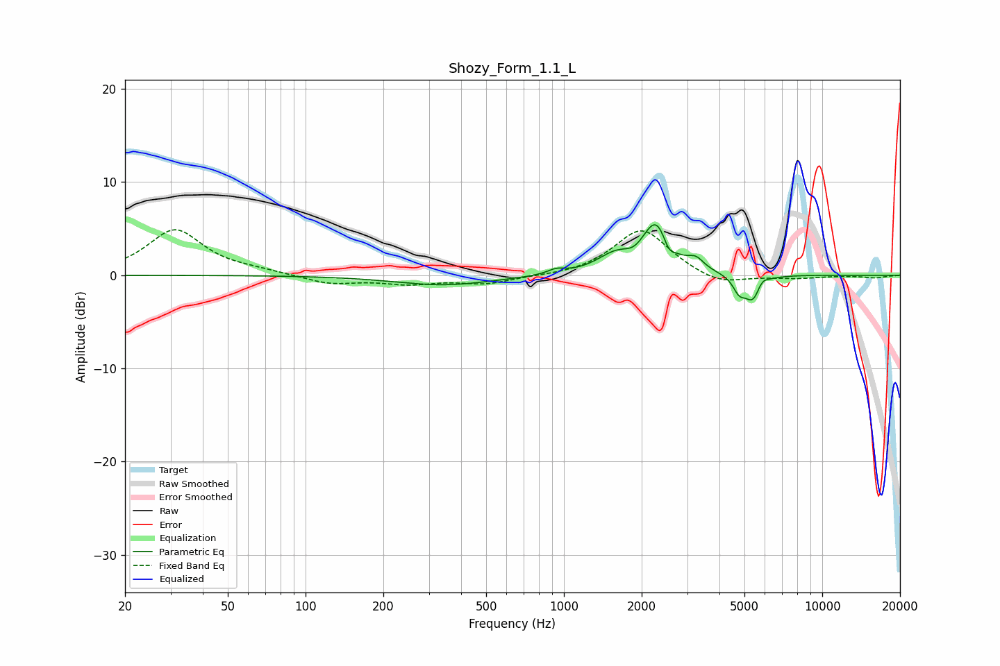

# Shozy_Form_1.1_L
See [usage instructions](https://github.com/jaakkopasanen/AutoEq#usage) for more options and info.

### Parametric EQs
Apply preamp of -5.5 dB when using parametric equalizer.

|   # | Type    |   Fc (Hz) |    Q |   Gain (dB) |
|-----|---------|-----------|------|-------------|
|   1 | Peaking |       343 | 0.74 |        -1.1 |
|   2 | Peaking |       932 | 4.34 |         0.5 |
|   3 | Peaking |      1593 | 1.91 |         1.9 |
|   4 | Peaking |      1860 | 4.01 |        -0.6 |
|   5 | Peaking |      2285 | 2.65 |         5.4 |
|   6 | Peaking |      2544 | 6    |        -1.5 |
|   7 | Peaking |      3248 | 4.73 |         1   |
|   8 | Peaking |      4765 | 6    |        -1.5 |
|   9 | Peaking |      5407 | 4.33 |        -2.9 |
|  10 | Peaking |      5810 | 6    |         1   |

### Fixed Band EQs
When using fixed band (also called graphic) equalizer, apply preamp of **-5.0 dB** (if available) and set gains manually with these parameters.

|   # | Type    |   Fc (Hz) |    Q |   Gain (dB) |
|-----|---------|-----------|------|-------------|
|   1 | Peaking |        31 | 1.41 |         4.9 |
|   2 | Peaking |        62 | 1.41 |         0.3 |
|   3 | Peaking |       125 | 1.41 |        -0.9 |
|   4 | Peaking |       250 | 1.41 |        -0.8 |
|   5 | Peaking |       500 | 1.41 |        -0.9 |
|   6 | Peaking |      1000 | 1.41 |        -0.1 |
|   7 | Peaking |      2000 | 1.41 |         5   |
|   8 | Peaking |      4000 | 1.41 |        -1.2 |
|   9 | Peaking |      8000 | 1.41 |        -0.3 |
|  10 | Peaking |     16000 | 1.41 |        -0.3 |

### Graphs

