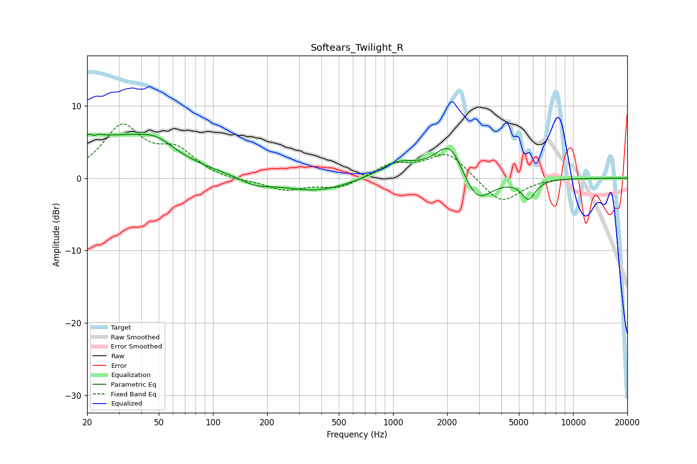

# Softears_Twilight_R
See [usage instructions](https://github.com/jaakkopasanen/AutoEq#usage) for more options and info.

### Parametric EQs
Apply preamp of -6.2 dB when using parametric equalizer.

|   # | Type    |   Fc (Hz) |    Q |   Gain (dB) |
|-----|---------|-----------|------|-------------|
|   1 | Peaking |        21 | 4.22 |         3.7 |
|   2 | Peaking |        22 | 5.97 |        -2.5 |
|   3 | Peaking |        31 | 0.54 |         5.4 |
|   4 | Peaking |        49 | 1.62 |         1.4 |
|   5 | Peaking |       172 | 1.64 |        -1   |
|   6 | Peaking |       372 | 0.74 |        -1.9 |
|   7 | Peaking |      1075 | 1.3  |         2.2 |
|   8 | Peaking |      2071 | 1.75 |         5.3 |
|   9 | Peaking |      2902 | 1.73 |        -4.4 |
|  10 | Peaking |      5648 | 3.62 |        -2.7 |

### Fixed Band EQs
When using fixed band (also called graphic) equalizer, apply preamp of **-7.6 dB** (if available) and set gains manually with these parameters.

|   # | Type    |   Fc (Hz) |    Q |   Gain (dB) |
|-----|---------|-----------|------|-------------|
|   1 | Peaking |        31 | 1.41 |         6.9 |
|   2 | Peaking |        62 | 1.41 |         3.4 |
|   3 | Peaking |       125 | 1.41 |        -0.4 |
|   4 | Peaking |       250 | 1.41 |        -1.6 |
|   5 | Peaking |       500 | 1.41 |        -1.4 |
|   6 | Peaking |      1000 | 1.41 |         1.8 |
|   7 | Peaking |      2000 | 1.41 |         3.6 |
|   8 | Peaking |      4000 | 1.41 |        -3.6 |
|   9 | Peaking |      8000 | 1.41 |         0.1 |
|  10 | Peaking |     16000 | 1.41 |         0   |

### Graphs

