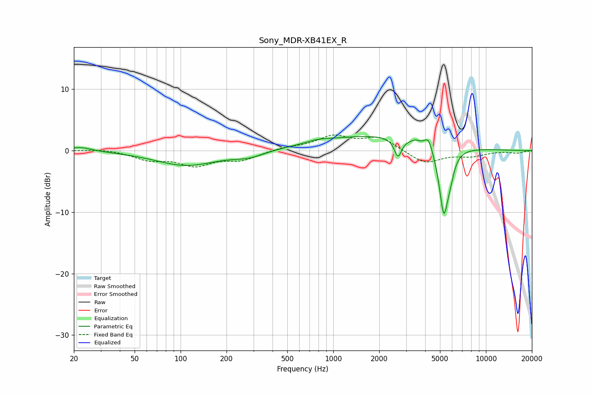

# Sony_MDR-XB41EX_R
See [usage instructions](https://github.com/jaakkopasanen/AutoEq#usage) for more options and info.

### Parametric EQs
Apply preamp of -2.4 dB when using parametric equalizer.

|   # | Type    |   Fc (Hz) |    Q |   Gain (dB) |
|-----|---------|-----------|------|-------------|
|   1 | Peaking |        22 | 1.95 |         0.7 |
|   2 | Peaking |       109 | 0.71 |        -2.4 |
|   3 | Peaking |       281 | 1.42 |        -0.9 |
|   4 | Peaking |       793 | 2.21 |         0.4 |
|   5 | Peaking |      1863 | 0.36 |         2.5 |
|   6 | Peaking |      2654 | 6    |        -3   |
|   7 | Peaking |      3459 | 5.4  |         0.4 |
|   8 | Peaking |      4210 | 5.36 |         2.1 |
|   9 | Peaking |      5300 | 4.41 |       -11.1 |
|  10 | Peaking |      5855 | 6    |        -1.8 |

### Fixed Band EQs
When using fixed band (also called graphic) equalizer, apply preamp of **-2.6 dB** (if available) and set gains manually with these parameters.

|   # | Type    |   Fc (Hz) |    Q |   Gain (dB) |
|-----|---------|-----------|------|-------------|
|   1 | Peaking |        31 | 1.41 |         0.3 |
|   2 | Peaking |        62 | 1.41 |        -1.3 |
|   3 | Peaking |       125 | 1.41 |        -2.2 |
|   4 | Peaking |       250 | 1.41 |        -1.4 |
|   5 | Peaking |       500 | 1.41 |         0.5 |
|   6 | Peaking |      1000 | 1.41 |         2.2 |
|   7 | Peaking |      2000 | 1.41 |         2.1 |
|   8 | Peaking |      4000 | 1.41 |        -2.1 |
|   9 | Peaking |      8000 | 1.41 |        -0.8 |
|  10 | Peaking |     16000 | 1.41 |        -0.4 |

### Graphs

