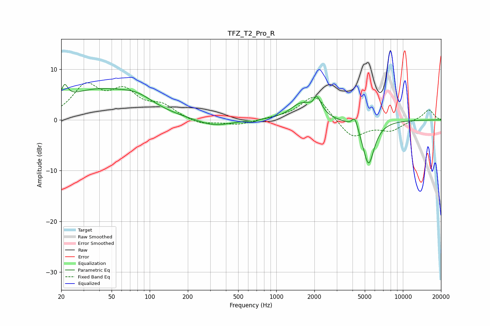

# TFZ_T2_Pro_R
See [usage instructions](https://github.com/jaakkopasanen/AutoEq#usage) for more options and info.

### Parametric EQs
Apply preamp of -7.1 dB when using parametric equalizer.

|   # | Type    |   Fc (Hz) |    Q |   Gain (dB) |
|-----|---------|-----------|------|-------------|
|   1 | Peaking |        21 | 5.84 |         2.7 |
|   2 | Peaking |        38 | 0.48 |         5.6 |
|   3 | Peaking |        80 | 1.07 |         2   |
|   4 | Peaking |       321 | 1.04 |        -1.4 |
|   5 | Peaking |       651 | 5.97 |        -0.4 |
|   6 | Peaking |      1552 | 1.72 |         2.8 |
|   7 | Peaking |      1960 | 5.18 |        -2.1 |
|   8 | Peaking |      2045 | 3.8  |         5.1 |
|   9 | Peaking |      4182 | 6    |         2.3 |
|  10 | Peaking |      5352 | 2.98 |        -8.8 |

### Fixed Band EQs
When using fixed band (also called graphic) equalizer, apply preamp of **-7.4 dB** (if available) and set gains manually with these parameters.

|   # | Type    |   Fc (Hz) |    Q |   Gain (dB) |
|-----|---------|-----------|------|-------------|
|   1 | Peaking |        31 | 1.41 |         6.3 |
|   2 | Peaking |        62 | 1.41 |         4.9 |
|   3 | Peaking |       125 | 1.41 |         2.4 |
|   4 | Peaking |       250 | 1.41 |        -1   |
|   5 | Peaking |       500 | 1.41 |        -1   |
|   6 | Peaking |      1000 | 1.41 |         0.2 |
|   7 | Peaking |      2000 | 1.41 |         5.1 |
|   8 | Peaking |      4000 | 1.41 |        -3.7 |
|   9 | Peaking |      8000 | 1.41 |        -1.9 |
|  10 | Peaking |     16000 | 1.41 |         2.1 |

### Graphs

