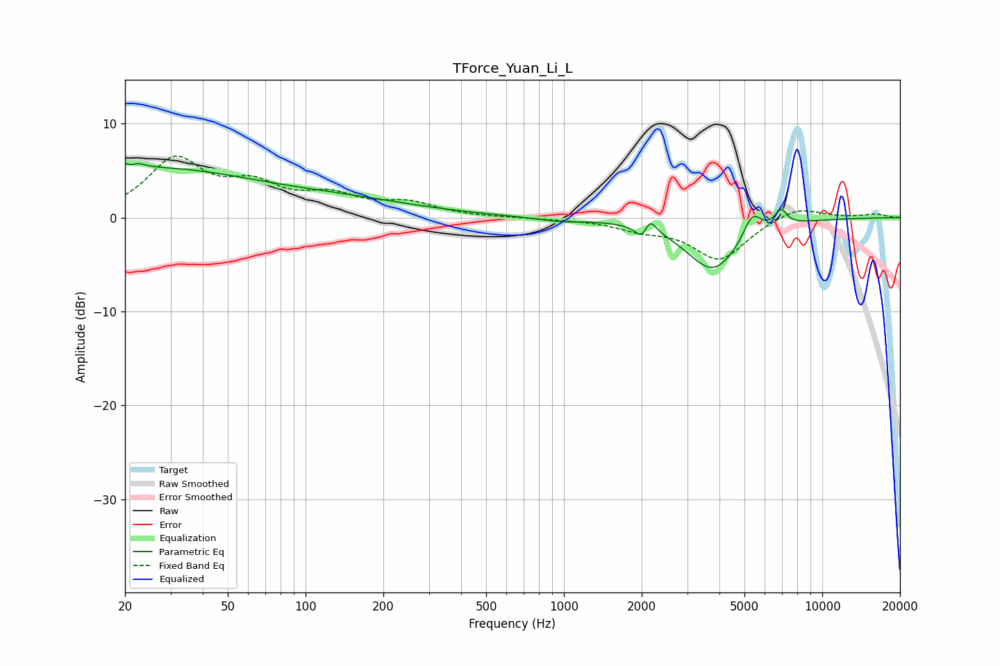

# TForce_Yuan_Li_L
See [usage instructions](https://github.com/jaakkopasanen/AutoEq#usage) for more options and info.

### Parametric EQs
Apply preamp of -5.8 dB when using parametric equalizer.

|   # | Type    |   Fc (Hz) |    Q |   Gain (dB) |
|-----|---------|-----------|------|-------------|
|   1 | Peaking |        21 | 4.83 |         3.9 |
|   2 | Peaking |        21 | 6    |        -3.2 |
|   3 | Peaking |        26 | 0.37 |         4.9 |
|   4 | Peaking |       142 | 0.47 |         1.5 |
|   5 | Peaking |       953 | 1.62 |        -0.4 |
|   6 | Peaking |      2014 | 5.93 |        -1.6 |
|   7 | Peaking |      2144 | 5.97 |         1.8 |
|   8 | Peaking |      3776 | 1.36 |        -5.6 |
|   9 | Peaking |      5359 | 4.02 |         2.5 |
|  10 | Peaking |      6915 | 5.9  |         1.7 |

### Fixed Band EQs
When using fixed band (also called graphic) equalizer, apply preamp of **-6.7 dB** (if available) and set gains manually with these parameters.

|   # | Type    |   Fc (Hz) |    Q |   Gain (dB) |
|-----|---------|-----------|------|-------------|
|   1 | Peaking |        31 | 1.41 |         5.9 |
|   2 | Peaking |        62 | 1.41 |         2.9 |
|   3 | Peaking |       125 | 1.41 |         2   |
|   4 | Peaking |       250 | 1.41 |         1.4 |
|   5 | Peaking |       500 | 1.41 |        -0   |
|   6 | Peaking |      1000 | 1.41 |        -0.1 |
|   7 | Peaking |      2000 | 1.41 |        -1   |
|   8 | Peaking |      4000 | 1.41 |        -4.4 |
|   9 | Peaking |      8000 | 1.41 |         1.3 |
|  10 | Peaking |     16000 | 1.41 |         0.4 |

### Graphs

