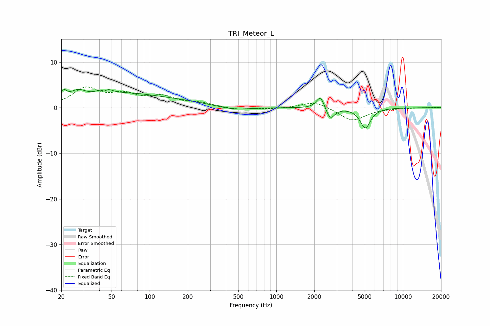

# TRI_Meteor_L
See [usage instructions](https://github.com/jaakkopasanen/AutoEq#usage) for more options and info.

### Parametric EQs
Apply preamp of -4.1 dB when using parametric equalizer.

|   # | Type    |   Fc (Hz) |    Q |   Gain (dB) |
|-----|---------|-----------|------|-------------|
|   1 | Peaking |        21 | 5.67 |         2   |
|   2 | Peaking |        27 | 2.16 |         2.3 |
|   3 | Peaking |        44 | 5.39 |        -2.8 |
|   4 | Peaking |        44 | 3.73 |         3.6 |
|   5 | Peaking |        65 | 0.52 |         2.7 |
|   6 | Peaking |       183 | 0.61 |         0.8 |
|   7 | Peaking |       462 | 1.16 |        -0.7 |
|   8 | Peaking |      2233 | 4.51 |         2.9 |
|   9 | Peaking |      2667 | 4.24 |        -2.7 |
|  10 | Peaking |      5050 | 3.43 |        -4.4 |

### Fixed Band EQs
When using fixed band (also called graphic) equalizer, apply preamp of **-4.6 dB** (if available) and set gains manually with these parameters.

|   # | Type    |   Fc (Hz) |    Q |   Gain (dB) |
|-----|---------|-----------|------|-------------|
|   1 | Peaking |        31 | 1.41 |         4   |
|   2 | Peaking |        62 | 1.41 |         2.4 |
|   3 | Peaking |       125 | 1.41 |         2.1 |
|   4 | Peaking |       250 | 1.41 |         0.9 |
|   5 | Peaking |       500 | 1.41 |        -0.5 |
|   6 | Peaking |      1000 | 1.41 |        -0.3 |
|   7 | Peaking |      2000 | 1.41 |         1.5 |
|   8 | Peaking |      4000 | 1.41 |        -2.9 |
|   9 | Peaking |      8000 | 1.41 |        -0.1 |
|  10 | Peaking |     16000 | 1.41 |         0   |

### Graphs

