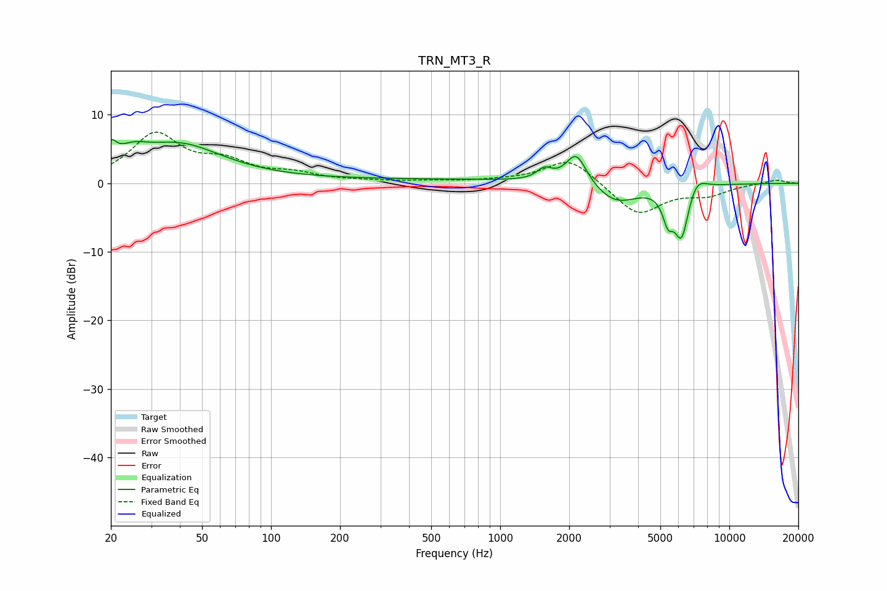

# TRN_MT3_R
See [usage instructions](https://github.com/jaakkopasanen/AutoEq#usage) for more options and info.

### Parametric EQs
Apply preamp of -6.5 dB when using parametric equalizer.

|   # | Type    |   Fc (Hz) |    Q |   Gain (dB) |
|-----|---------|-----------|------|-------------|
|   1 | Peaking |        20 | 6    |         2.6 |
|   2 | Peaking |        25 | 2.04 |         2.1 |
|   3 | Peaking |        40 | 0.73 |         5.3 |
|   4 | Peaking |       370 | 0.18 |         0.6 |
|   5 | Peaking |      1561 | 4.33 |         1.6 |
|   6 | Peaking |      2147 | 3.14 |         4.6 |
|   7 | Peaking |      3203 | 1.5  |        -2.9 |
|   8 | Peaking |      5398 | 5.97 |        -3.7 |
|   9 | Peaking |      6185 | 4.18 |        -7.7 |
|  10 | Peaking |      7177 | 3.31 |         2.2 |

### Fixed Band EQs
When using fixed band (also called graphic) equalizer, apply preamp of **-7.6 dB** (if available) and set gains manually with these parameters.

|   # | Type    |   Fc (Hz) |    Q |   Gain (dB) |
|-----|---------|-----------|------|-------------|
|   1 | Peaking |        31 | 1.41 |         6.9 |
|   2 | Peaking |        62 | 1.41 |         2.6 |
|   3 | Peaking |       125 | 1.41 |         1.2 |
|   4 | Peaking |       250 | 1.41 |         0.2 |
|   5 | Peaking |       500 | 1.41 |         0.3 |
|   6 | Peaking |      1000 | 1.41 |         0.3 |
|   7 | Peaking |      2000 | 1.41 |         3.8 |
|   8 | Peaking |      4000 | 1.41 |        -4.7 |
|   9 | Peaking |      8000 | 1.41 |        -1.5 |
|  10 | Peaking |     16000 | 1.41 |         0.6 |

### Graphs

