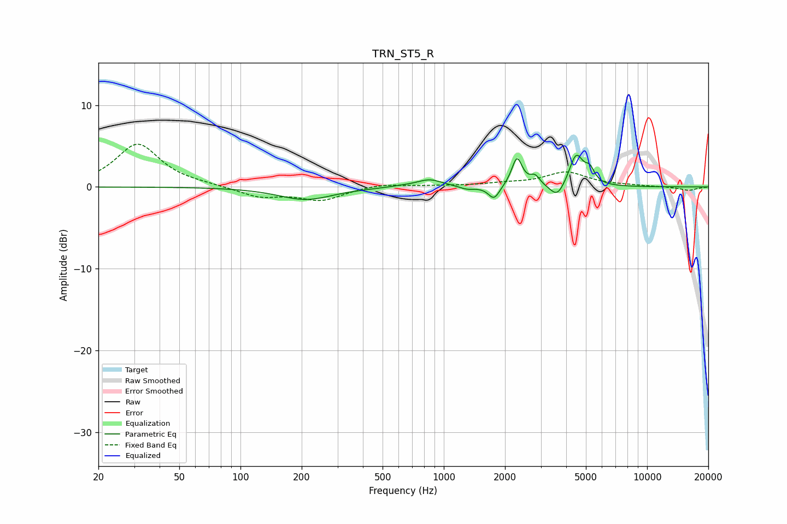

# TRN_ST5_R
See [usage instructions](https://github.com/jaakkopasanen/AutoEq#usage) for more options and info.

### Parametric EQs
Apply preamp of -4.0 dB when using parametric equalizer.

|   # | Type    |   Fc (Hz) |    Q |   Gain (dB) |
|-----|---------|-----------|------|-------------|
|   1 | Peaking |       209 | 1.07 |        -1.5 |
|   2 | Peaking |       619 | 2.29 |         0.1 |
|   3 | Peaking |       852 | 2.21 |         0.9 |
|   4 | Peaking |      1303 | 3.77 |        -0.4 |
|   5 | Peaking |      1767 | 5.07 |        -1.7 |
|   6 | Peaking |      2291 | 5.53 |         3.5 |
|   7 | Peaking |      2813 | 6    |         1.1 |
|   8 | Peaking |      3619 | 3.99 |        -1.8 |
|   9 | Peaking |      4482 | 4.14 |         3.9 |
|  10 | Peaking |      5225 | 5.99 |         1.5 |

### Fixed Band EQs
When using fixed band (also called graphic) equalizer, apply preamp of **-5.3 dB** (if available) and set gains manually with these parameters.

|   # | Type    |   Fc (Hz) |    Q |   Gain (dB) |
|-----|---------|-----------|------|-------------|
|   1 | Peaking |        31 | 1.41 |         5.2 |
|   2 | Peaking |        62 | 1.41 |         0.2 |
|   3 | Peaking |       125 | 1.41 |        -1.2 |
|   4 | Peaking |       250 | 1.41 |        -1.6 |
|   5 | Peaking |       500 | 1.41 |         0.4 |
|   6 | Peaking |      1000 | 1.41 |         0.1 |
|   7 | Peaking |      2000 | 1.41 |         0.3 |
|   8 | Peaking |      4000 | 1.41 |         1.8 |
|   9 | Peaking |      8000 | 1.41 |         0.1 |
|  10 | Peaking |     16000 | 1.41 |        -0.4 |

### Graphs

