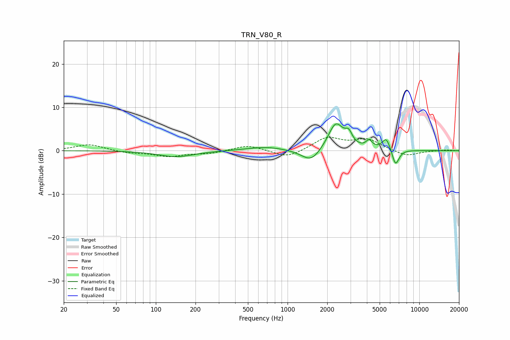

# TRN_V80_R
See [usage instructions](https://github.com/jaakkopasanen/AutoEq#usage) for more options and info.

### Parametric EQs
Apply preamp of -6.3 dB when using parametric equalizer.

|   # | Type    |   Fc (Hz) |    Q |   Gain (dB) |
|-----|---------|-----------|------|-------------|
|   1 | Peaking |       143 | 1.07 |        -1.4 |
|   2 | Peaking |       499 | 1.06 |         0.1 |
|   3 | Peaking |       697 | 1.1  |         0.8 |
|   4 | Peaking |      1513 | 1.94 |        -3.1 |
|   5 | Peaking |      2323 | 2.37 |         6.5 |
|   6 | Peaking |      2911 | 5.35 |         2.3 |
|   7 | Peaking |      4161 | 6    |         1.7 |
|   8 | Peaking |      5600 | 4.69 |         2.8 |
|   9 | Peaking |      6550 | 6    |        -2.9 |
|  10 | Peaking |      6818 | 5.03 |        -1   |

### Fixed Band EQs
When using fixed band (also called graphic) equalizer, apply preamp of **-3.2 dB** (if available) and set gains manually with these parameters.

|   # | Type    |   Fc (Hz) |    Q |   Gain (dB) |
|-----|---------|-----------|------|-------------|
|   1 | Peaking |        31 | 1.41 |         1.5 |
|   2 | Peaking |        62 | 1.41 |        -0.5 |
|   3 | Peaking |       125 | 1.41 |        -1.3 |
|   4 | Peaking |       250 | 1.41 |        -0.6 |
|   5 | Peaking |       500 | 1.41 |         1.3 |
|   6 | Peaking |      1000 | 1.41 |        -1.8 |
|   7 | Peaking |      2000 | 1.41 |         2.9 |
|   8 | Peaking |      4000 | 1.41 |         2.5 |
|   9 | Peaking |      8000 | 1.41 |        -1.3 |
|  10 | Peaking |     16000 | 1.41 |         0.2 |

### Graphs

