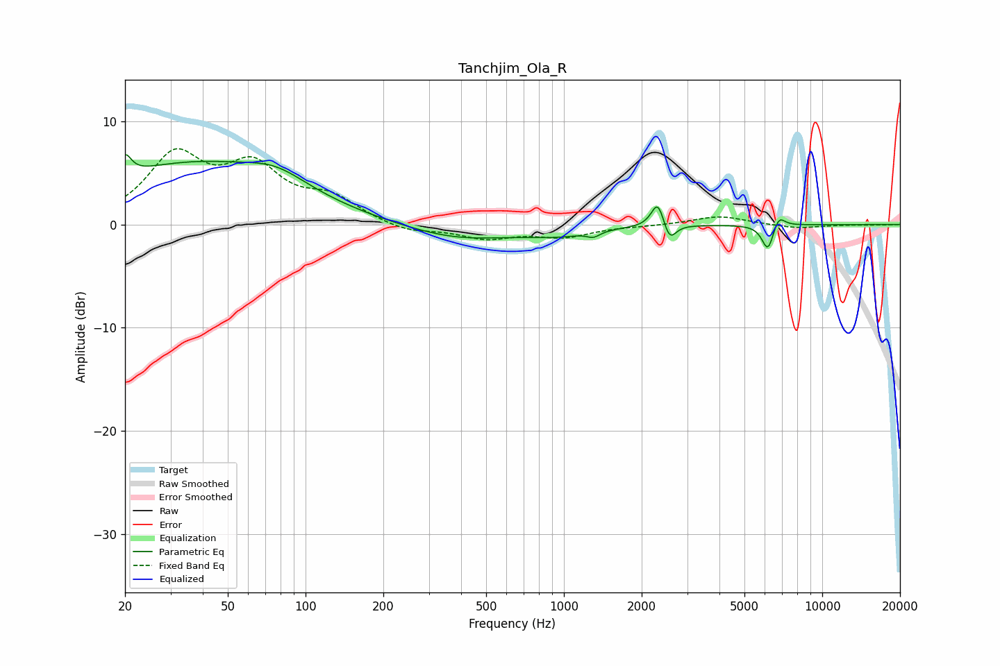

# Tanchjim_Ola_R
See [usage instructions](https://github.com/jaakkopasanen/AutoEq#usage) for more options and info.

### Parametric EQs
Apply preamp of -6.9 dB when using parametric equalizer.

|   # | Type    |   Fc (Hz) |    Q |   Gain (dB) |
|-----|---------|-----------|------|-------------|
|   1 | Peaking |        20 | 6    |         2   |
|   2 | Peaking |        36 | 0.37 |         5.8 |
|   3 | Peaking |        77 | 1.21 |         1.6 |
|   4 | Peaking |       390 | 0.66 |        -1.5 |
|   5 | Peaking |       954 | 1.14 |        -0.7 |
|   6 | Peaking |      1300 | 5.83 |        -0.5 |
|   7 | Peaking |      2310 | 5.84 |         2.6 |
|   8 | Peaking |      2561 | 6    |        -1.8 |
|   9 | Peaking |      6170 | 6    |        -2.7 |
|  10 | Peaking |      6764 | 5.7  |         1.3 |

### Fixed Band EQs
When using fixed band (also called graphic) equalizer, apply preamp of **-7.4 dB** (if available) and set gains manually with these parameters.

|   # | Type    |   Fc (Hz) |    Q |   Gain (dB) |
|-----|---------|-----------|------|-------------|
|   1 | Peaking |        31 | 1.41 |         6.3 |
|   2 | Peaking |        62 | 1.41 |         5   |
|   3 | Peaking |       125 | 1.41 |         2.2 |
|   4 | Peaking |       250 | 1.41 |        -0.8 |
|   5 | Peaking |       500 | 1.41 |        -1.3 |
|   6 | Peaking |      1000 | 1.41 |        -1.1 |
|   7 | Peaking |      2000 | 1.41 |        -0.1 |
|   8 | Peaking |      4000 | 1.41 |         0.8 |
|   9 | Peaking |      8000 | 1.41 |        -0.4 |
|  10 | Peaking |     16000 | 1.41 |        -0   |

### Graphs

